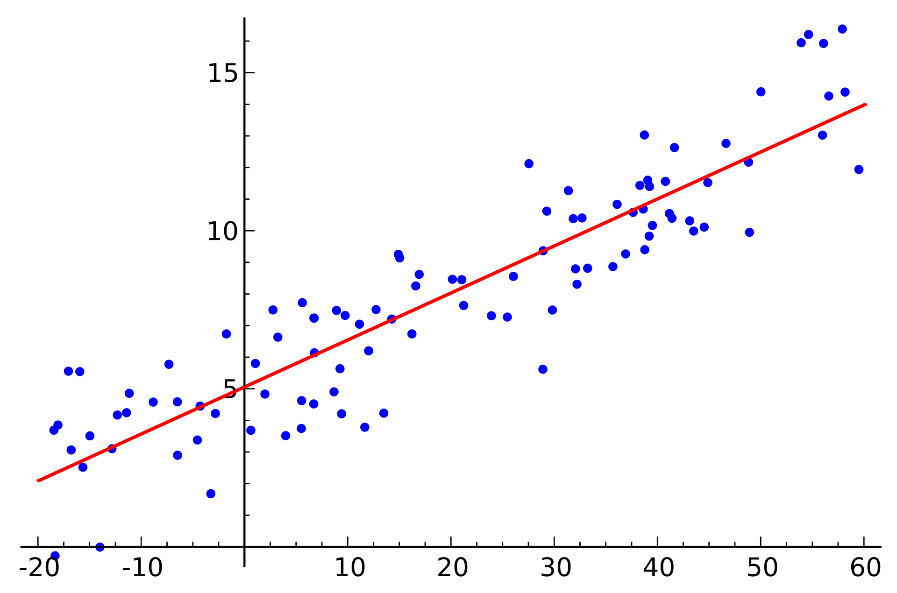

# 3.2.1 Machine Learning Model

Machine learning models involve computers discovering how they can perform tasks without being explicitly programmed to do so. It involves computers learning from data provided so that they carry out certain tasks. For simple tasks assigned to computers, it is possible to program algorithms telling the machine how to execute all steps required to solve the problem at hand; on the computer's part, no learning is needed. For more advanced tasks, it can be challenging for a human to manually create the needed algorithms. In practice, it can turn out to be more effective to help the machine develop its own algorithm, rather than having human programmers specify every needed step. Linear regression, logistic regression, and the decision tree are commonly used, interpretable models. We will be using the variants of these models as listed below.

* GLM - Generalized Linear Model
* GBM - Gradient Boosting Model
* DRF - Distributed Random Forest

All interpretable models explained in this book are interpretable on a modular level.

### 3.2.1.1 GLM - Generalized Linear Model

 First, let’s clear up some potential misunderstandings about terminology.  The term _general linear model_ \(GLM\) usually refers to conventional linear regression models for a continuous response variable given continuous and/or categorical predictors. It includes multiple linear regression, as well as ANOVA.

The generalized linear models \(GLMs\) are a broad class of models that include linear regression, ANOVA, Poisson regression, log-linear models, etc. The table below provides a good summary of GLMs

| **Model** | **Random** | **Link** | **Systematic** |
| :--- | :--- | :--- | :--- |
| Linear Regression | Normal | Identity | Continuous |
| ANOVA | Normal | Identity | Categorical |
| ANCOVA | Normal | Identity | Mixed |
| Logistic Regression | Binomial | Logit | Mixed |
| Loglinear | Poisson | Log | Categorical |
| Poisson Regression | Poisson | Log | Mixed |
| Multinomial response | Multinomial | Generalized Logit | Mixed |

**GLM: Simple Linear Regression** models how to __mean the expected value of a continuous response variable depends on a set of explanatory variables, where index _i_ stands for each data point:

_`Yi=β0+βxi+ϵi`_

**GLM: Binary Logistic Regression** models how binary response variable _Y_ depends on a set of _k_ explanatory variables, _X=\(X_1, _X_2, ... _Xk_\). 

_`logit(π)=log(π1−π)=β0+βxi+…+β0+βxk`_

* Linear function e.g. can have only a linear predictor in the systematic component
* Responses must be independent

But there are some limitations of GLMs too, such as,

### 3.2.1.2 GBM - Gradient Boosting Model

Gradient boosted machines \(GBMs\) are an extremely popular machine learning algorithm that has proven successful across many domains. Whereas random forests build an ensemble of deep independent trees, GBMs build an ensemble of shallow and weak successive trees with each tree learning and improving on the previous.

#### Gradient descent 

Many algorithms, including decision trees, focus on minimizing the residuals and, therefore, emphasize the MSE loss function. The algorithm discussed in the previous section outlines the approach of sequentially fitting regression trees to minimize the errors. This specific approach is how gradient boosting minimizes the mean squared error \(MSE\) loss function. However, often we wish to focus on other loss functions such as mean absolute error \(MAE\) or to be able to apply the method to a classification problem with a loss function such as deviance. The name _**gradient**_ boosting machines come from the fact that this procedure can be generalized to the loss functions other than MSE.

Gradient boosting is considered a _**gradient descent**_ algorithm. Gradient descent is a very generic optimization algorithm capable of finding optimal solutions to a wide range of problems. The general idea of gradient descent is to tweak parameters iteratively in order to minimize a cost function. Suppose you are a downhill skier racing your friend. A good strategy to beat your friend to the bottom is to take the path with the steepest slope. This is exactly what gradient descent does - it measures the local gradient of the loss \(cost\) function for a given set of parameters \(ΘΘ\) and takes steps in the direction of the descending gradient. Once the gradient is zero, we have reached the minimum.

Gradient descent can be performed on any loss function that is differentiable. Consequently, this allows GBMs to optimize different loss functions as desired. An important parameter in gradient descent is the size of the steps which is determined by the _learning rate_. If the learning rate is too small, then the algorithm will take many iterations to find the minimum. On the other hand, if the learning rate is too high, you might jump cross the minimum and end up further away than when you started.

Moreover, not all cost functions are convex \(bowl-shaped\). There may be local minima, plateaus, and other irregular terrains of the loss function that makes finding the global minimum difficult. _**Stochastic gradient descent**_ can help us address this problem by sampling a fraction of the training observations \(typically without replacement\) and growing the next tree using that subsample. This makes the algorithm faster but the stochastic nature of random sampling also adds some random nature in descending the loss function gradient. Although this randomness does not allow the algorithm to find the absolute global minimum, it can actually help the algorithm jump out of local minima and off plateaus and get near the global minimum.

As we’ll see in the next section, there are several hyperparameter tuning options that allow us to address how we approach the gradient descent of our loss function.

#### Tuning 

Part of the beauty and challenges of GBM is that they offer several tuning parameters. The beauty in this is GBMs are highly flexible. The challenge is that they can be time-consuming to tune and find the optimal combination of hyperparameters. The most common hyperparameters that you will find in most GBM implementations include:

* **The number of trees:** The total number of trees to fit. GBMs often require many trees; however, unlike random forests, GBMs can overfit so the goal is to find the optimal number of trees that minimize the loss function of interest with cross-validation.
* **Depth of trees:** The number _d_ of splits in each tree, which controls the complexity of the boosted ensemble. Often d=1d=1 works well, in which case each tree is a _stump_ consisting of a single split. More commonly, d is greater than 1 but it is unlikely d&gt;10d&gt;10 will be required.
* **Learning rate:** Controls how quickly the algorithm proceeds down the gradient descent. Smaller values reduce the chance of overfitting but also increases the time to find the optimal fit. This is also called _shrinkage_.
* **Subsampling:** Controls whether or not you use a fraction of the available training observations. Using less than 100% of the training observations means you are implementing stochastic gradient descent. This can help to minimize overfitting and keep from getting stuck in a local minimum or plateau of the loss function gradient.

GBMs are one of the most powerful ensemble algorithms that are often first-in-class with predictive accuracy. Although they are less intuitive and more computationally demanding than many other machine learning algorithms, they are essential to have in your toolbox.

### 3.2.1.3 DRF - Distributed Random Forest

_**Decision Trees**:_ A decision tree is a Machine Learning algorithm capable of fitting complex datasets and performing both classification and regression tasks. The idea behind a tree is to search for a pair of variable-value within the training set and split it in such a way that will generate the "best" two child subsets. The goal is to create branches and leaves based on an optimal splitting criterion, a process called tree growing. 

Specifically, at every branch or node, a conditional statement classifies the data point based on a fixed threshold in a specific variable, therefore splitting the data. To make predictions, every new instance starts in the root node \(top of the tree\) and moves along the branches until it reaches a leaf node where no further branching is possible.

_What is an Ensemble Method?_

An ensemble method or ensemble learning algorithm consists of aggregating multiple outputs made by a diverse set of predictors to obtain better results. Formally, based on a set of “weak” learners we are trying to use a “strong” learner for our model. Therefore, the purpose of using ensemble methods is: to average out the outcome of individual predictions by diversifying the set of predictors, thus lowering the variance, to arrive at a powerful prediction model that reduces overfitting our training set.

In our case, a Random Forest \(strong learner\) is built as an ensemble of Decision Trees \(weak learners\) to perform different tasks such as regression and classification.

Random Forests are trained via the bagging method. Bagging or Bootstrap Aggregating, consists of randomly sampling subsets of the training data, fitting a model to these smaller data sets, and aggregating the predictions. This method allows several instances to be used repeatedly for the training stage given that we are sampling with replacement. Tree bagging consists of sampling subsets of the training set, fitting a Decision Tree to each, and aggregating their result.

