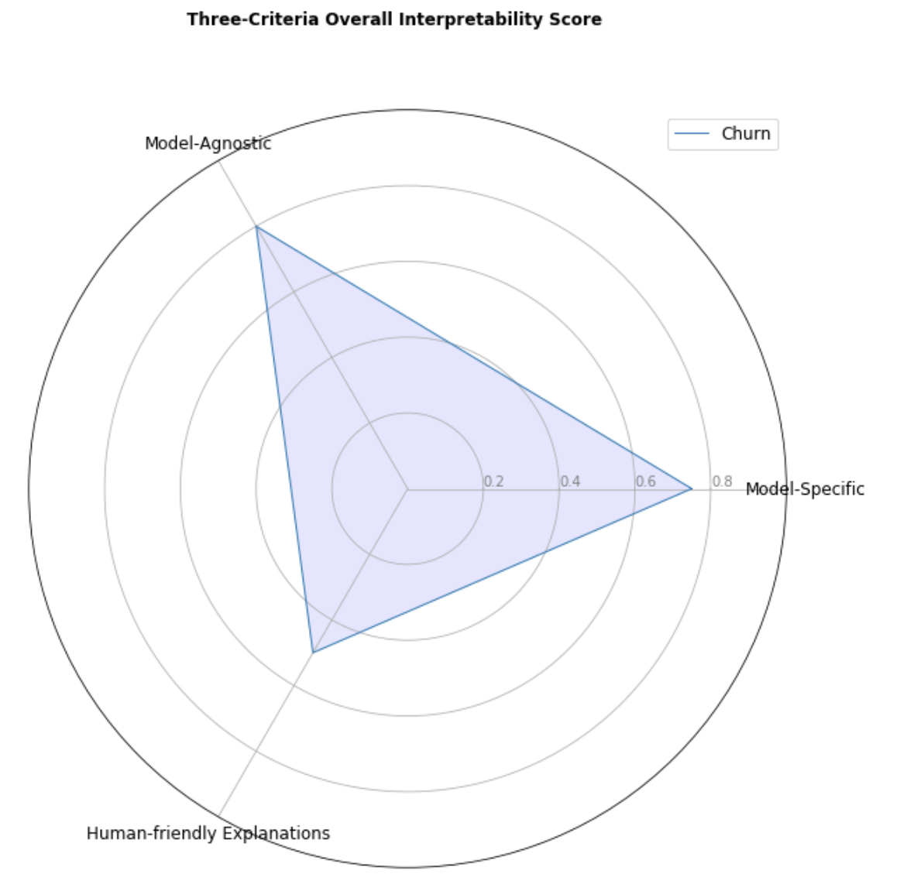
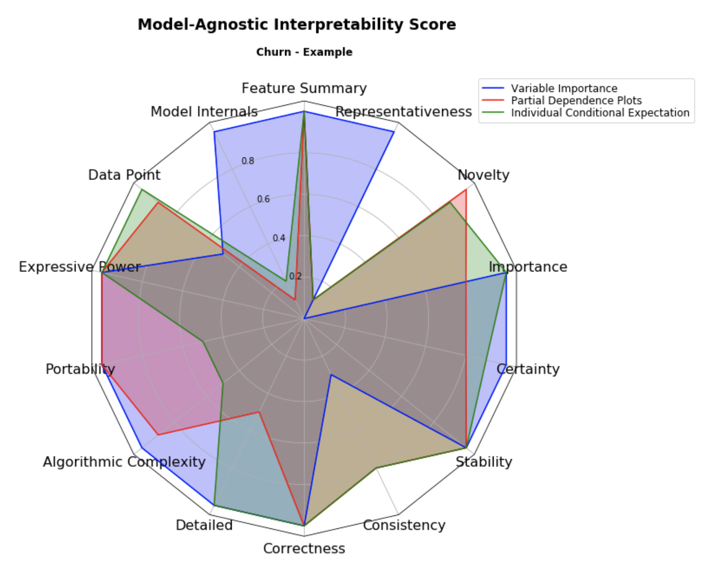
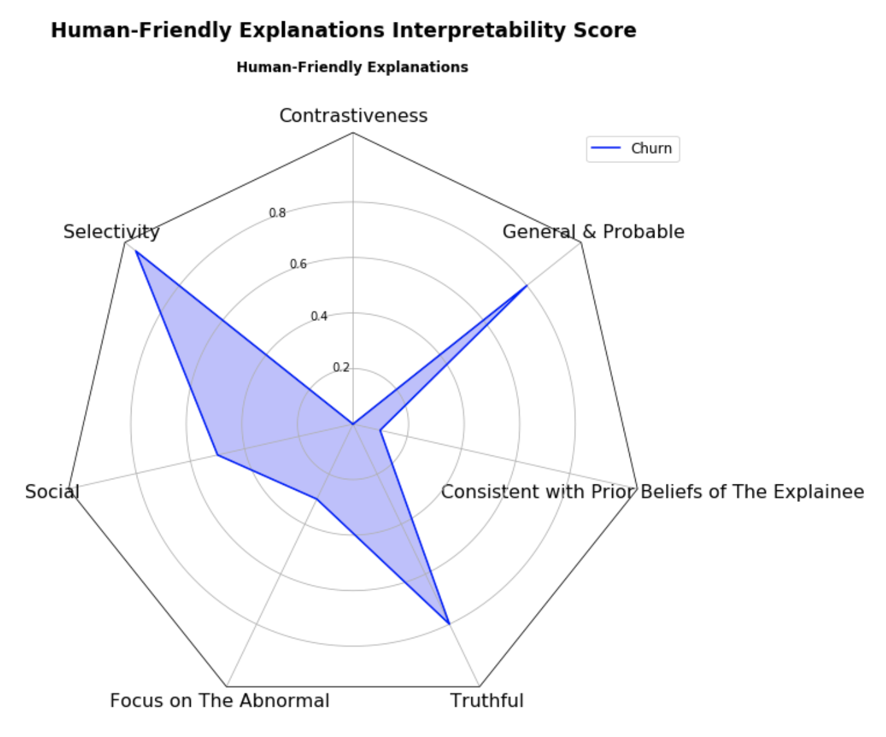

# 5.3 Results & Explanation

## 5.3.1 Score Table

According to our Evaluation System, we can easily get the score tables of _the Churn Notebook_ from the three criteria:

### 5.3.1.1 Interpretable Model / Model-Specific

The table below is scored based on the properties specific to the models that were generated based on the algorithms in the notebook. 

**Ex:** GBM scores 0.5 for the Linearity, because, it shows no-linearity as well as linearity as it is usually considered for classification as well as continuous distribution problems to address.

Similarly, XGBoost has been scored 0.1 as it shows no linearity in any aspect, the reason being it to be a tree-based model.

| Algorithm/Property | Linearity | Monotonicity | Interaction | Parametric | Transparent | Algorithmic complexity |
| :--- | :--- | :--- | :--- | :--- | :--- | :--- |
| **Logistic Regression** | 1 | 1 | 1 | 1 | 1 | 1 |
| **Gradient Boosting** | 0.5 | 0.7 | 0.7 | 1 | 1 | 0.8 |
| **XGBoost** | 0.1 | 0.4 | 0.7 | 0.9 | 0 | 0.7 |

### 5.3.1.2 Model-Agnostic

The table below is scored based on the Model-agnostic methods used in the notebook, in the previous chapter.

**Ex:** Variable Importance, being one of the methods has been scored 1 for Feature Summary because it provides the user the information about a specific feature when tried to interpret.

Similarly, another explanation for the score would be - PDP has been scored 0.9 for the Datapoint due to the plot consisting of data to be plotted over the graph and giving the user a visual representation of how the feature would vary to the target as the feature increases.

| Method/Property | Feature summary | Model internals | Datapoint | A Surrogate intrinsically interpretable model | Expressive power | Portability | Algorithmic complexity | Detailed | Correctness | Consistency | Stability | Certainty | Importance | Novelty | Representativeness |
| :--- | :--- | :--- | :--- | :--- | :--- | :--- | :--- | :--- | :--- | :--- | :--- | :--- | :--- | :--- | :--- |
| **Variable Importance** | 1 | 1 | 0.5 | / | 1 | 1 | 1 | 1 | 1 | 0.3 | 1 | 1 | 1 | 0 | 1 |
| **PDP** | 1 | 0.1 | 0.9 | / | 1 | 1 | 0.9 | 0.5 | 1 | 0.8 | 1 | 0.8 | 0.8 | 1 | 0.1 |
| **ICE** | 1 | 0.2 | 1 | / | 1 | 0.5 | 0.5 | 1 | 1 | 0.8 | 1 | 0.9 | 1 | 0.9 | 0.1 |

### 5.3.1.3 Human-friendly Explanation

We have scored the notebook based on the Human-Friendly Explanations that can be inferred from the Notebook. We have tried to score them based on the definitions giving under the [**Ch. 4.2.3**](../4.-evaluation-system-of-interpretable-machine-learning/4.2.1-the-structure-of-the-evaluation-system/4.2.4-human-explanations.md)**.**

| Model/Property | Contrastiveness | Selectivity | Social | Focus on the abnormal | Truthful | Consistent with prior beliefs of the explainer | General and probable |
| :--- | :--- | :--- | :--- | :--- | :--- | :--- | :--- |
| **Churn** | 0 | 1 | 0.5 | 0.3 | 0.8 | 0.1 | 0.8 |

## 5.3.2 Radar Charts

Based on the above score tables which are the result from the example Notebook, we demonstrated the score tables by using the [**Radar Chart**](https://en.wikipedia.org/wiki/Radar_chart). This helps users understand the scores better.

There are 4 Radar Charts.

1. **Overall Score**
2. **Model-Specific Score**
3. **Model-Agnostic Score**
4. **Human-Friendly Explanation Score**

Each of the above score radars is plotted and explained below. 

**NOTE:** There graphs will differ for different datasets as the score tables for different datasets will be different, based on the methods and properties being interpreted from them.

### 5.3.2.1 Overall Score

The overall score for the structure of the evaluation system has been calculated by taking the SUM\(_**average score of each property/method within the system**\)._

**Ex:** The average of the metrics in Interpretable Models 

| AVG | 0.53 | 0.7 | 0.8 | 0.96 | 0.66 | 0.83 |
| :--- | :--- | :--- | :--- | :--- | :--- | :--- |

The sum of the AVG is 0.75. Thus, the score for the Interpretable Models\(Model-Specific\) is **0.75**

**Similarly, the rest of the methods have been scored and plotted to provide the Overall Score Chart**

### 5.3.2.2 Model-Specific Score

Now, as we have a score for the overall methods, we get deep into the specific methods and plot the radar plot for the individual metrics as below. The below is plotting the scores of metrics under Interpretable Models referring to the score table above, given under 5.3.1.1.

### 5.3.2.3 Model-Agnostic Score

The next plot is for the Model-Agnostic score radar plot referring to the score table given in the section 5.3.1.2

### 5.3.2.4 Human-Friendly Explanation Score

Similarly, the below plot is for the Human-Friendly Explanations to the score table given under the section 5.3.1.3 

The above, graphs help us understand more in-depth of the score that each interpretable method has scored, and by visualizing, helps the reader or the user to understand and select the methods based on his/her requirements.

**NOTE:** _**We will be using different datasets to infer the same further and see how the respective scores of the datasets make the visualization better and help the user to judge the requirements and make a clear evaluation of the interpretable systems to help develop further.**_ 

