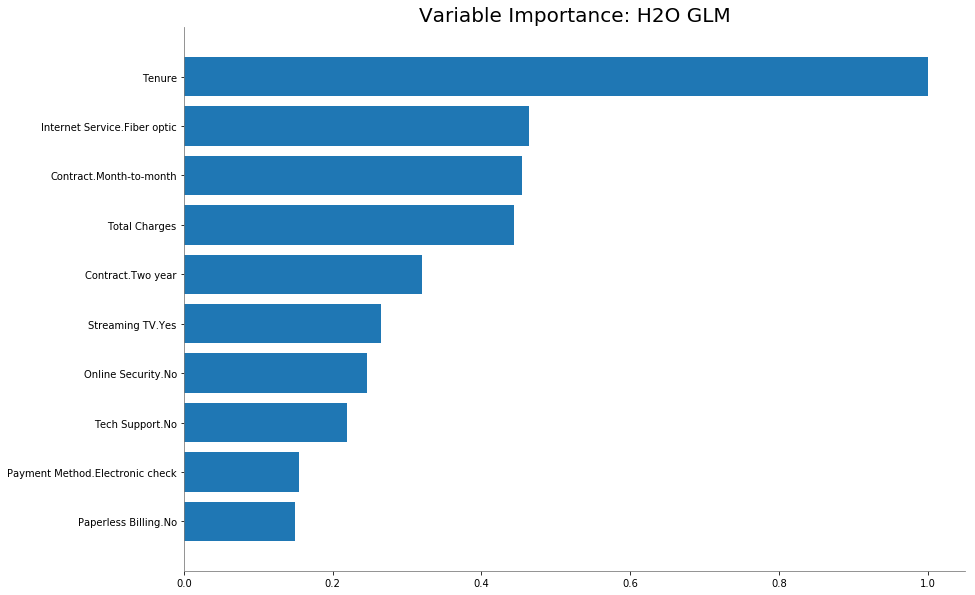
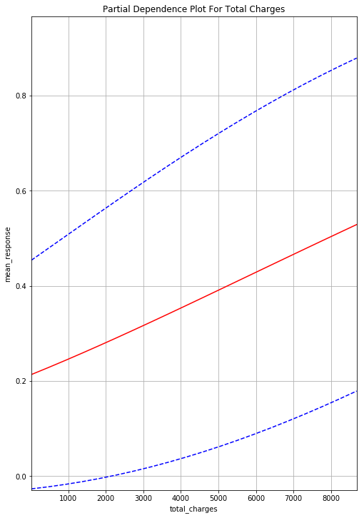
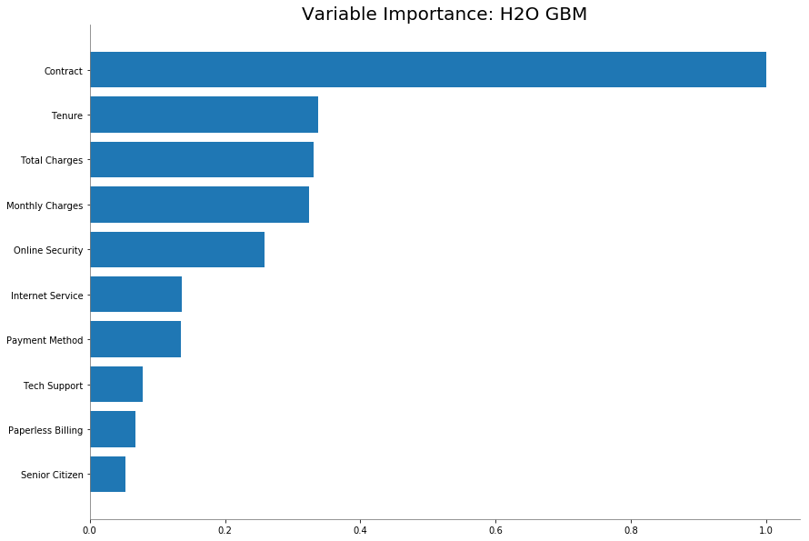
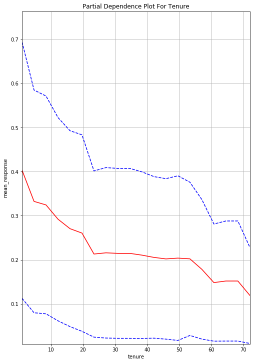
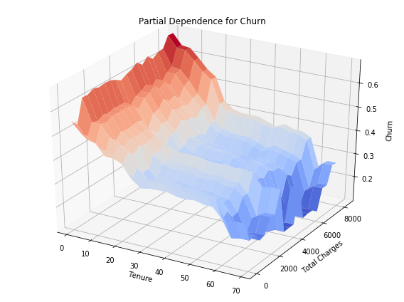
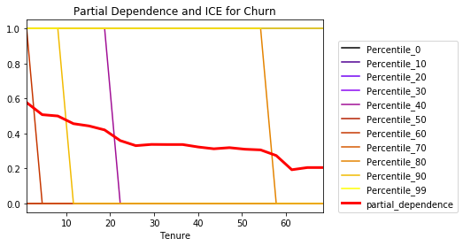
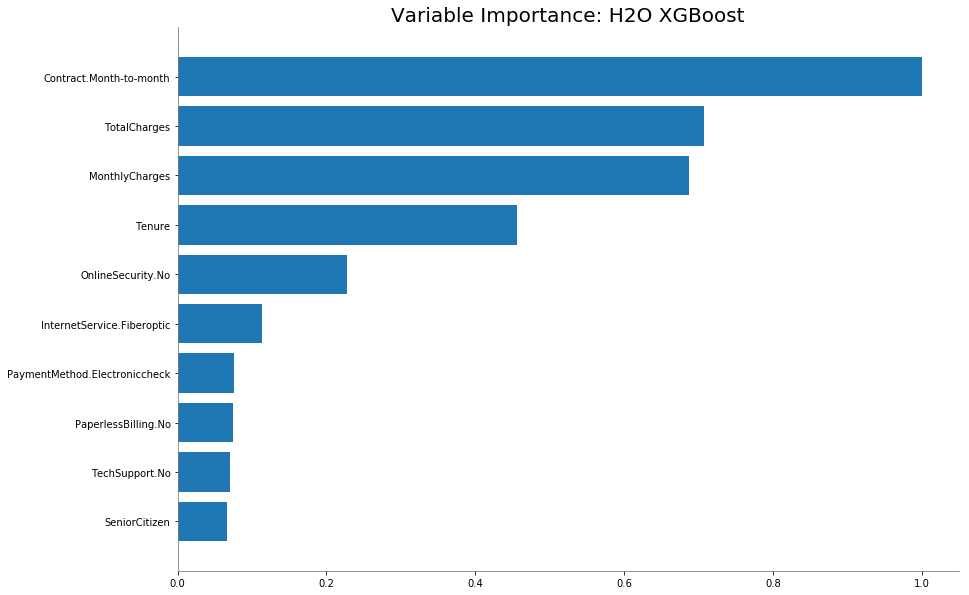
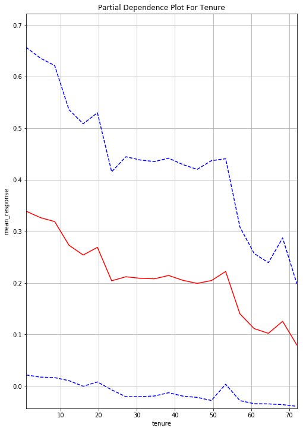
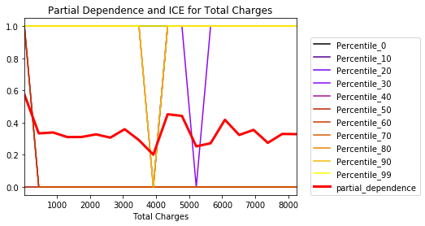

# 5.2.2 Notebook

```python
import h2o
import psutil
from h2o.automl import H2OAutoML
from h2o.estimators.glm import H2OGeneralizedLinearEstimator
from h2o.estimators import H2OGradientBoostingEstimator
import pandas as pd
import numpy as np
from h2o.estimators.random_forest import H2ORandomForestEstimator
import matplotlib.pyplot as plt
```

## 1 Initialize H2O

```python
pct_memory=4
virtual_memory=psutil.virtual_memory()
min_mem_size=int(round(int(pct_memory*virtual_memory.available)/1073741824,0))
print(min_mem_size)
```

```text
8
```

```python
h2o.init(strict_version_check=False,max_mem_size=min_mem_size)
```

```text
Checking whether there is an H2O instance running at http://localhost:54321 ..... not found.
Attempting to start a local H2O server...
  Java Version: openjdk version "1.8.0_152-release"; OpenJDK Runtime Environment (build 1.8.0_152-release-1056-b12); OpenJDK 64-Bit Server VM (build 25.152-b12, mixed mode)
  Starting server from /Library/Frameworks/Python.framework/Versions/3.7/lib/python3.7/site-packages/h2o/backend/bin/h2o.jar
  Ice root: /var/folders/25/079nl8ps1d17m_b9mm9cwnhm0000gn/T/tmpp_c51ipx
  JVM stdout: /var/folders/25/079nl8ps1d17m_b9mm9cwnhm0000gn/T/tmpp_c51ipx/h2o_guruisi_started_from_python.out
  JVM stderr: /var/folders/25/079nl8ps1d17m_b9mm9cwnhm0000gn/T/tmpp_c51ipx/h2o_guruisi_started_from_python.err
  Server is running at http://127.0.0.1:54321
Connecting to H2O server at http://127.0.0.1:54321 ... successful.
```

| H2O cluster uptime: | 02 secs |
| :--- | :--- |
| H2O cluster timezone: | America/New\_York |
| H2O data parsing timezone: | UTC |
| H2O cluster version: | 3.24.0.2 |
| H2O cluster version age: | 1 year, 3 months and 23 days !!! |
| H2O cluster name: | H2O\_from\_python\_guruisi\_r1jxcs |
| H2O cluster total nodes: | 1 |
| H2O cluster free memory: | 7.111 Gb |
| H2O cluster total cores: | 4 |
| H2O cluster allowed cores: | 4 |
| H2O cluster status: | accepting new members, healthy |
| H2O connection url: | http://127.0.0.1:54321 |
| H2O connection proxy: | None |
| H2O internal security: | False |
| H2O API Extensions: | Amazon S3, XGBoost, Algos, AutoML, Core V3, Core V4 |
| Python version: | 3.7.4 final |

## 2 Data Preprocessing

```python
# Insert an index column as 'Id' in order to slice the dataset for ICE plot
data_path = "../data/Churn_Train.csv"
df = pd.read_csv(data_path)
df['Id'] = df.index
df.to_csv("../data/Churn.csv", index = False)
```

```python
# Read the dataset with 'Id' column in H2O
data_path = "../data/Churn.csv"
df = h2o.import_file(data_path)
df.shape
```

```text
(6499, 22)
```

```python
df.head(5)
```

| CustomerID | Gender |  Senior Citizen | Partner | Dependents |  Tenure | Phone Service | Multiple Lines | Internet Service | Online Security | Online Backup | Device Protection | Tech Support | Streaming TV | Streaming Movies | Contract | Paperless Billing | Payment Method |  Monthly Charges |  Total Charges | Churn |  Id |
| :--- | :--- | :--- | :--- | :--- | :--- | :--- | :--- | :--- | :--- | :--- | :--- | :--- | :--- | :--- | :--- | :--- | :--- | :--- | :--- | :--- | :--- |
| 7590-VHVEG | Female |  0 | Yes | No |  1 | No | No phone service | DSL | No | Yes | No | No | No | No | Month-to-month | Yes | Electronic check |  29.85 |  29.85 | No |  0 |
| 5575-GNVDE | Male |  0 | No | No |  34 | Yes | No | DSL | Yes | No | Yes | No | No | No | One year | No | Mailed check |  56.95 |  1889.5 | No |  1 |
| 3668-QPYBK | Male |  0 | No | No |  2 | Yes | No | DSL | Yes | Yes | No | No | No | No | Month-to-month | Yes | Mailed check |  53.85 |  108.15 | Yes |  2 |
| 7795-CFOCW | Male |  0 | No | No |  45 | No | No phone service | DSL | Yes | No | Yes | Yes | No | No | One year | No | Bank transfer \(automatic\) |  42.3 |  1840.75 | No |  3 |
| 9237-HQITU | Female |  0 | No | No |  2 | Yes | No | Fiber optic | No | No | No | No | No | No | Month-to-month | Yes | Electronic check |  70.7 |  151.65 | Yes |  4 |

Finding the missing data. The missing data only takes 0.14% of the whole dataset, therefore, dropping the missing data is our solution.

```python
df.isna().sum()
```

```text
9.0
```

```python
df = df.na_omit()
```

```python
df.isna().sum()
```

```text
0.0
```

Separating the target column and numerical columns.  
 **Target** : 'Churn'  
 **Non-feature**: 'CustomerID' & 'Id'

**What Is Churn Rate In Business Area?**   
The churn rate, also known as the rate of attrition or customer churn, is the rate at which customers stop doing business with an entity. It is most commonly expressed as the percentage of service subscribers who discontinue their subscriptions within a given time period. It is also the rate at which employees leave their jobs within a certain period. For a company to expand its client, its growth rate \(measured by the number of new customers\) must exceed its churn rate.

```python
target = 'Churn'
X = list(set(df.columns) - set(['Churn']) - set(['CustomerID']) - set(['Id']))
X
```

```text
['Online Backup',
 'Phone Service',
 'Partner',
 'Senior Citizen',
 'Contract',
 'Device Protection',
 'Tenure',
 'Gender',
 'Internet Service',
 'Online Security',
 'Monthly Charges',
 'Paperless Billing',
 'Streaming Movies',
 'Multiple Lines',
 'Payment Method',
 'Tech Support',
 'Dependents',
 'Total Charges',
 'Streaming TV']
```

Running the H2O AutoML to get the models leaderboard. Since the target 'Churn' is a binomial target, the problem we are facing here is a classification problem.

```python
aml = H2OAutoML(max_runtime_secs=600)
```

```python
aml.train(x=X,y=target,training_frame=df)
```

```text
AutoML progress: |████████████████████████████████████████████████████████| 100%
```

```python
aml_leaderboard_df=aml.leaderboard.as_data_frame()
aml_leaderboard_df
```

|  | model\_id | auc | logloss | mean\_per\_class\_error | rmse | mse |
| :--- | :--- | :--- | :--- | :--- | :--- | :--- |
| 0 | StackedEnsemble\_BestOfFamily\_AutoML\_20200809\_1... | 0.850180 | 0.417073 | 0.226777 | 0.366226 | 0.134121 |
| 1 | GBM\_grid\_1\_AutoML\_20200809\_184844\_model\_18 | 0.850156 | 0.409682 | 0.230198 | 0.364476 | 0.132843 |
| 2 | GBM\_grid\_1\_AutoML\_20200809\_184844\_model\_20 | 0.849776 | 0.410381 | 0.234533 | 0.364628 | 0.132953 |
| 3 | StackedEnsemble\_AllModels\_AutoML\_20200809\_184844 | 0.849452 | 0.417161 | 0.228774 | 0.366490 | 0.134315 |
| 4 | GBM\_grid\_1\_AutoML\_20200809\_184844\_model\_16 | 0.849246 | 0.411673 | 0.238235 | 0.365142 | 0.133329 |
| 5 | GBM\_grid\_1\_AutoML\_20200809\_184844\_model\_12 | 0.848980 | 0.452791 | 0.234555 | 0.381081 | 0.145222 |
| 6 | GBM\_grid\_1\_AutoML\_20200809\_184844\_model\_14 | 0.848974 | 0.412404 | 0.225886 | 0.365270 | 0.133422 |
| 7 | GBM\_grid\_1\_AutoML\_20200809\_224838\_model\_8 | 0.848855 | 0.431964 | 0.240782 | 0.372267 | 0.138582 |
| 8 | GBM\_grid\_1\_AutoML\_20200809\_184844\_model\_3 | 0.848788 | 0.432952 | 0.237229 | 0.372787 | 0.138970 |
| 9 | GBM\_grid\_1\_AutoML\_20200809\_184844\_model\_1 | 0.848785 | 0.434713 | 0.228669 | 0.373369 | 0.139405 |
| 10 | XGBoost\_grid\_1\_AutoML\_20200809\_224838\_model\_9 | 0.848772 | 0.411119 | 0.232333 | 0.365420 | 0.133531 |
| 11 | GBM\_grid\_1\_AutoML\_20200809\_224838\_model\_12 | 0.848654 | 0.411532 | 0.234209 | 0.365369 | 0.133494 |
| 12 | GBM\_grid\_1\_AutoML\_20200809\_224838\_model\_7 | 0.848639 | 0.414071 | 0.236514 | 0.366018 | 0.133970 |
| 13 | GBM\_grid\_1\_AutoML\_20200809\_224838\_model\_5 | 0.848601 | 0.431544 | 0.240111 | 0.371907 | 0.138315 |
| 14 | GBM\_grid\_1\_AutoML\_20200809\_184844\_model\_13 | 0.848597 | 0.412046 | 0.233466 | 0.365329 | 0.133465 |
| 15 | XGBoost\_grid\_1\_AutoML\_20200809\_224838\_model\_5 | 0.848483 | 0.415327 | 0.232322 | 0.365961 | 0.133928 |
| 16 | GBM\_5\_AutoML\_20200809\_184844 | 0.848407 | 0.411846 | 0.235760 | 0.365449 | 0.133553 |
| 17 | XGBoost\_grid\_1\_AutoML\_20200809\_224838\_model\_2 | 0.848375 | 0.411610 | 0.229764 | 0.365684 | 0.133724 |
| 18 | XGBoost\_3\_AutoML\_20200809\_224838 | 0.848356 | 0.412230 | 0.229621 | 0.365567 | 0.133639 |
| 19 | GBM\_grid\_1\_AutoML\_20200809\_224838\_model\_11 | 0.848199 | 0.413048 | 0.234907 | 0.365655 | 0.133704 |
| 20 | GBM\_grid\_1\_AutoML\_20200809\_224838\_model\_15 | 0.848197 | 0.435540 | 0.229049 | 0.373651 | 0.139615 |
| 21 | GBM\_grid\_1\_AutoML\_20200809\_184844\_model\_8 | 0.848169 | 0.441859 | 0.234264 | 0.376513 | 0.141762 |
| 22 | XGBoost\_3\_AutoML\_20200809\_184844 | 0.848065 | 0.412465 | 0.237157 | 0.365700 | 0.133736 |
| 23 | XGBoost\_2\_AutoML\_20200809\_184844 | 0.847559 | 0.413327 | 0.234434 | 0.366205 | 0.134106 |
| 24 | XGBoost\_grid\_1\_AutoML\_20200809\_184844\_model\_10 | 0.847499 | 0.415598 | 0.237966 | 0.366557 | 0.134364 |
| 25 | GBM\_grid\_1\_AutoML\_20200809\_184844\_model\_19 | 0.847337 | 0.436593 | 0.235980 | 0.374232 | 0.140050 |
| 26 | GBM\_5\_AutoML\_20200809\_224838 | 0.847264 | 0.412953 | 0.233433 | 0.366141 | 0.134059 |
| 27 | XGBoost\_2\_AutoML\_20200809\_224838 | 0.847197 | 0.413653 | 0.231425 | 0.366346 | 0.134210 |
| 28 | GBM\_grid\_1\_AutoML\_20200809\_224838\_model\_4 | 0.846974 | 0.439954 | 0.240557 | 0.376069 | 0.141428 |
| 29 | XGBoost\_grid\_1\_AutoML\_20200809\_224838\_model\_1 | 0.846642 | 0.412812 | 0.232162 | 0.366473 | 0.134303 |
| ... | ... | ... | ... | ... | ... | ... |
| 70 | GBM\_grid\_1\_AutoML\_20200809\_224838\_model\_14 | 0.831422 | 0.432501 | 0.243522 | 0.375203 | 0.140777 |
| 71 | GBM\_grid\_1\_AutoML\_20200809\_224838\_model\_13 | 0.830757 | 0.435942 | 0.248588 | 0.376414 | 0.141687 |
| 72 | GBM\_4\_AutoML\_20200809\_184844 | 0.830160 | 0.438904 | 0.251052 | 0.377504 | 0.142509 |
| 73 | DeepLearning\_1\_AutoML\_20200809\_224838 | 0.829825 | 0.436108 | 0.254523 | 0.378159 | 0.143004 |
| 74 | XGBoost\_grid\_1\_AutoML\_20200809\_184844\_model\_3 | 0.829003 | 0.447995 | 0.250662 | 0.381721 | 0.145711 |
| 75 | DeepLearning\_grid\_1\_AutoML\_20200809\_184844\_mod... | 0.828073 | 0.505879 | 0.251965 | 0.388789 | 0.151157 |
| 76 | DeepLearning\_grid\_1\_AutoML\_20200809\_224838\_mod... | 0.827414 | 0.485080 | 0.249715 | 0.381528 | 0.145563 |
| 77 | DeepLearning\_grid\_1\_AutoML\_20200809\_224838\_mod... | 0.826863 | 0.463806 | 0.250040 | 0.382114 | 0.146011 |
| 78 | XGBoost\_grid\_1\_AutoML\_20200809\_184844\_model\_2 | 0.826246 | 0.447182 | 0.254606 | 0.382063 | 0.145972 |
| 79 | XGBoost\_grid\_1\_AutoML\_20200809\_224838\_model\_6 | 0.825827 | 0.453619 | 0.252576 | 0.382699 | 0.146458 |
| 80 | DeepLearning\_grid\_1\_AutoML\_20200809\_224838\_mod... | 0.824306 | 0.460778 | 0.256933 | 0.383795 | 0.147299 |
| 81 | XRT\_1\_AutoML\_20200809\_184844 | 0.822605 | 0.512764 | 0.259865 | 0.379563 | 0.144068 |
| 82 | XRT\_1\_AutoML\_20200809\_224838 | 0.821975 | 0.498749 | 0.259430 | 0.379496 | 0.144018 |
| 83 | GBM\_grid\_1\_AutoML\_20200809\_224838\_model\_17 | 0.821147 | 0.569075 | 0.251833 | 0.437177 | 0.191124 |
| 84 | DRF\_1\_AutoML\_20200809\_224838 | 0.820474 | 0.522540 | 0.256855 | 0.380883 | 0.145072 |
| 85 | GBM\_grid\_1\_AutoML\_20200809\_184844\_model\_5 | 0.819377 | 0.465534 | 0.260789 | 0.387906 | 0.150471 |
| 86 | DRF\_1\_AutoML\_20200809\_184844 | 0.819231 | 0.538513 | 0.255728 | 0.380744 | 0.144966 |
| 87 | GBM\_grid\_1\_AutoML\_20200809\_184844\_model\_7 | 0.816504 | 0.570223 | 0.255827 | 0.437693 | 0.191575 |
| 88 | DeepLearning\_grid\_1\_AutoML\_20200809\_184844\_mod... | 0.814457 | 0.464657 | 0.256316 | 0.387104 | 0.149850 |
| 89 | XGBoost\_grid\_1\_AutoML\_20200809\_184844\_model\_9 | 0.812922 | 0.497491 | 0.262802 | 0.398574 | 0.158861 |
| 90 | GBM\_grid\_1\_AutoML\_20200809\_184844\_model\_11 | 0.810966 | 0.568592 | 0.257857 | 0.436954 | 0.190928 |
| 91 | GBM\_grid\_1\_AutoML\_20200809\_184844\_model\_10 | 0.810071 | 0.483470 | 0.262444 | 0.391754 | 0.153472 |
| 92 | DeepLearning\_grid\_1\_AutoML\_20200809\_184844\_mod... | 0.809415 | 0.681625 | 0.257185 | 0.417600 | 0.174389 |
| 93 | GBM\_grid\_1\_AutoML\_20200809\_184844\_model\_17 | 0.807155 | 0.671564 | 0.261080 | 0.419363 | 0.175865 |
| 94 | DeepLearning\_grid\_1\_AutoML\_20200809\_184844\_mod... | 0.806609 | 0.665037 | 0.270382 | 0.397929 | 0.158348 |
| 95 | GBM\_grid\_1\_AutoML\_20200809\_224838\_model\_6 | 0.805700 | 0.500964 | 0.264710 | 0.399209 | 0.159368 |
| 96 | GBM\_grid\_1\_AutoML\_20200809\_184844\_model\_9 | 0.805206 | 0.568771 | 0.268710 | 0.437034 | 0.190999 |
| 97 | DeepLearning\_grid\_1\_AutoML\_20200809\_184844\_mod... | 0.803046 | 0.550576 | 0.271191 | 0.405248 | 0.164226 |
| 98 | XGBoost\_grid\_1\_AutoML\_20200809\_184844\_model\_7 | 0.792067 | 0.559789 | 0.277797 | 0.417189 | 0.174046 |
| 99 | GBM\_grid\_1\_AutoML\_20200809\_224838\_model\_2 | 0.789137 | 0.606154 | 0.282159 | 0.420276 | 0.176632 |

100 rows × 6 columns

## 3 Building Models

As the suggestion list generated from the evaluation system of interpretability, there are three models to build. Logistic Regression, Gradient Boosting Machine, and XGBoost Model. By taking advantage of the H2O Auto ML leaderboard, we are able to get the best models with the most suitable hyperparameter.

```python
# Build the models

logistic_model_local = H2OGeneralizedLinearEstimator(family = "binomial")

gbm_model_local = h2o.get_model('GBM_grid_1_AutoML_20200809_184844_model_18')

xgboost_model_local = h2o.get_model('XGBoost_grid_1_AutoML_20200809_224838_model_9')
```

```python
# Slice the dataframe into three parts: training df, valiadation df and testing df with the ratio 6:3:1

# cast to factor
df[1] = df[1].asfactor()

# Random UNIform numbers, one per row
r = df[0].runif()

# 60% for training data
train = df[ r < 0.6 ]

# 30% for validation
valid = df[ (0.6 <= r) & (r < 0.9) ]

# 10% for testing
test  = df[ 0.9 <= r ]
```

### 3.1 Logistic Regression

```python
# Train the Logistic Regression Model

logistic_model_local.train(x=X,
                           y= target,
                           training_frame = train,
                           validation_frame = valid)
```

```python
# Performance of Logistic Regression Model

logistic_model_local
```

```text
Model Details
=============
H2OGeneralizedLinearEstimator :  Generalized Linear Modeling
Model Key:  GLM_model_python_1597013319592_17144


ModelMetricsBinomialGLM: glm
** Reported on train data. **

MSE: 0.1313121673914865
RMSE: 0.36237020764887184
LogLoss: 0.40633115377777673
Null degrees of freedom: 3863
Residual degrees of freedom: 3836
Null deviance: 4482.797889446194
Residual deviance: 3140.127156394658
AIC: 3196.127156394658
AUC: 0.8558425142502644
pr_auc: 0.6758682461569124
Gini: 0.7116850285005287
Confusion Matrix (Act/Pred) for max f1 @ threshold = 0.25859197421042557: 
```

|  | **No** | **Yes** | **Error** | **Rate** |
| :--- | :--- | :--- | :--- | :--- |
| No | 2088.0 | 745.0 | 0.263 |  \(745.0/2833.0\) |
| Yes | 181.0 | 850.0 | 0.1756 |  \(181.0/1031.0\) |
| Total | 2269.0 | 1595.0 | 0.2396 |  \(926.0/3864.0\) |

```text
Maximum Metrics: Maximum metrics at their respective thresholds
```

| **metric** | **threshold** | **value** | **idx** |
| :--- | :--- | :--- | :--- |
| max f1 | 0.2585920 | 0.6473724 | 241.0 |
| max f2 | 0.1563713 | 0.7615521 | 288.0 |
| max f0point5 | 0.5398616 | 0.6524909 | 122.0 |
| max accuracy | 0.5398616 | 0.8115942 | 122.0 |
| max precision | 0.8750044 | 1.0 | 0.0 |
| max recall | 0.0031143 | 1.0 | 397.0 |
| max specificity | 0.8750044 | 1.0 | 0.0 |
| max absolute\_mcc | 0.2585920 | 0.5044077 | 241.0 |
| max min\_per\_class\_accuracy | 0.2989662 | 0.7720660 | 223.0 |
| max mean\_per\_class\_accuracy | 0.2585920 | 0.7807351 | 241.0 |

```text
Gains/Lift Table: Avg response rate: 26.68 %, avg score: 26.69 %
```

|  | **group** | **cumulative\_data\_fraction** | **lower\_threshold** | **lift** | **cumulative\_lift** | **response\_rate** | **score** | **cumulative\_response\_rate** | **cumulative\_score** | **capture\_rate** | **cumulative\_capture\_rate** | **gain** | **cumulative\_gain** |
| :--- | :--- | :--- | :--- | :--- | :--- | :--- | :--- | :--- | :--- | :--- | :--- | :--- | :--- |
|  | 1 | 0.0100932 | 0.8072080 | 3.2673282 | 3.2673282 | 0.8717949 | 0.8318661 | 0.8717949 | 0.8318661 | 0.0329777 | 0.0329777 | 226.7328210 | 226.7328210 |
|  | 2 | 0.0201863 | 0.7867289 | 3.0751324 | 3.1712303 | 0.8205128 | 0.7973382 | 0.8461538 | 0.8146022 | 0.0310378 | 0.0640155 | 207.5132433 | 217.1230322 |
|  | 3 | 0.0300207 | 0.7708700 | 3.2546838 | 3.1985685 | 0.8684211 | 0.7784711 | 0.8534483 | 0.8027661 | 0.0320078 | 0.0960233 | 225.4683751 | 219.8568514 |
|  | 4 | 0.0401139 | 0.7558323 | 3.2673282 | 3.2158693 | 0.8717949 | 0.7653157 | 0.8580645 | 0.7933431 | 0.0329777 | 0.1290010 | 226.7328210 | 221.5869341 |
|  | 5 | 0.0502070 | 0.7380001 | 2.7868388 | 3.1296209 | 0.7435897 | 0.7467696 | 0.8350515 | 0.7839804 | 0.0281280 | 0.1571290 | 178.6838767 | 212.9620927 |
|  | 6 | 0.1001553 | 0.6729028 | 2.8351367 | 2.9827593 | 0.7564767 | 0.7046722 | 0.7958656 | 0.7444288 | 0.1416101 | 0.2987391 | 183.5136670 | 198.2759269 |
|  | 7 | 0.1501035 | 0.6071369 | 2.3885056 | 2.7850162 | 0.6373057 | 0.6387067 | 0.7431034 | 0.7092489 | 0.1193016 | 0.4180407 | 138.8505551 | 178.5016221 |
|  | 8 | 0.2000518 | 0.5381941 | 2.0778056 | 2.6084423 | 0.5544041 | 0.5722402 | 0.6959897 | 0.6750410 | 0.1037827 | 0.5218235 | 107.7805642 | 160.8442299 |
|  | 9 | 0.2999482 | 0.3962338 | 1.5437902 | 2.2538645 | 0.4119171 | 0.4683588 | 0.6013805 | 0.6062064 | 0.1542192 | 0.6760427 | 54.3790173 | 125.3864456 |
|  | 10 | 0.4001035 | 0.2677629 | 1.2976940 | 2.0145126 | 0.3462532 | 0.3286738 | 0.5375162 | 0.5367335 | 0.1299709 | 0.8060136 | 29.7693968 | 101.4512593 |
|  | 11 | 0.5 | 0.1837581 | 0.7961685 | 1.7710960 | 0.2124352 | 0.2207226 | 0.4725673 | 0.4735967 | 0.0795344 | 0.8855480 | -20.3831483 | 77.1096023 |
|  | 12 | 0.5998965 | 0.1104158 | 0.5922717 | 1.5747948 | 0.1580311 | 0.1484992 | 0.4201898 | 0.4194606 | 0.0591659 | 0.9447139 | -40.7728298 | 57.4794820 |
|  | 13 | 0.7000518 | 0.0617657 | 0.2808442 | 1.3896714 | 0.0749354 | 0.0847926 | 0.3707948 | 0.3715802 | 0.0281280 | 0.9728419 | -71.9155783 | 38.9671388 |
|  | 14 | 0.7999482 | 0.0286901 | 0.1262218 | 1.2318935 | 0.0336788 | 0.0437199 | 0.3286962 | 0.3306374 | 0.0126091 | 0.9854510 | -87.3778162 | 23.1893476 |
|  | 15 | 0.8998447 | 0.0107940 | 0.0970937 | 1.1059134 | 0.0259067 | 0.0186504 | 0.2950820 | 0.2960021 | 0.0096993 | 0.9951503 | -90.2906278 | 10.5913406 |
|  | 16 | 1.0 | 0.0013001 | 0.0484214 | 1.0 | 0.0129199 | 0.0050078 | 0.2668219 | 0.2668575 | 0.0048497 | 1.0 | -95.1578583 | 0.0 |

```text
ModelMetricsBinomialGLM: glm
** Reported on validation data. **

MSE: 0.13988195347217955
RMSE: 0.3740079591027169
LogLoss: 0.42669574270102295
Null degrees of freedom: 1963
Residual degrees of freedom: 1936
Null deviance: 2254.1867641245126
Residual deviance: 1676.060877329618
AIC: 1732.060877329618
AUC: 0.8334476691632231
pr_auc: 0.6085277427369343
Gini: 0.6668953383264462
Confusion Matrix (Act/Pred) for max f1 @ threshold = 0.3933891185861035: 
```

|  | **No** | **Yes** | **Error** | **Rate** |
| :--- | :--- | :--- | :--- | :--- |
| No | 1189.0 | 263.0 | 0.1811 |  \(263.0/1452.0\) |
| Yes | 163.0 | 349.0 | 0.3184 |  \(163.0/512.0\) |
| Total | 1352.0 | 612.0 | 0.2169 |  \(426.0/1964.0\) |

```text
Maximum Metrics: Maximum metrics at their respective thresholds
```

| **metric** | **threshold** | **value** | **idx** |
| :--- | :--- | :--- | :--- |
| max f1 | 0.3933891 | 0.6209964 | 177.0 |
| max f2 | 0.1467309 | 0.7441787 | 296.0 |
| max f0point5 | 0.5139588 | 0.6147913 | 124.0 |
| max accuracy | 0.5208544 | 0.7998982 | 121.0 |
| max precision | 0.8712309 | 1.0 | 0.0 |
| max recall | 0.0066205 | 1.0 | 393.0 |
| max specificity | 0.8712309 | 1.0 | 0.0 |
| max absolute\_mcc | 0.3933891 | 0.4744255 | 177.0 |
| max min\_per\_class\_accuracy | 0.3241675 | 0.7519531 | 210.0 |
| max mean\_per\_class\_accuracy | 0.2878493 | 0.7594885 | 226.0 |

```text
Gains/Lift Table: Avg response rate: 26.07 %, avg score: 27.45 %
```

|  | **group** | **cumulative\_data\_fraction** | **lower\_threshold** | **lift** | **cumulative\_lift** | **response\_rate** | **score** | **cumulative\_response\_rate** | **cumulative\_score** | **capture\_rate** | **cumulative\_capture\_rate** | **gain** | **cumulative\_gain** |
| :--- | :--- | :--- | :--- | :--- | :--- | :--- | :--- | :--- | :--- | :--- | :--- | :--- | :--- |
|  | 1 | 0.0101833 | 0.8083745 | 3.0687500 | 3.0687500 | 0.8 | 0.8366588 | 0.8 | 0.8366588 | 0.03125 | 0.03125 | 206.8750000 | 206.8750000 |
|  | 2 | 0.0203666 | 0.7814955 | 2.4933594 | 2.7810547 | 0.65 | 0.7940115 | 0.725 | 0.8153352 | 0.0253906 | 0.0566406 | 149.3359375 | 178.1054688 |
|  | 3 | 0.0300407 | 0.7625985 | 2.8264803 | 2.7956833 | 0.7368421 | 0.7728231 | 0.7288136 | 0.8016448 | 0.0273438 | 0.0839844 | 182.6480263 | 179.5683263 |
|  | 4 | 0.0402240 | 0.7433646 | 2.8769531 | 2.8162579 | 0.75 | 0.7519586 | 0.7341772 | 0.7890660 | 0.0292969 | 0.1132812 | 187.6953125 | 181.6257911 |
|  | 5 | 0.0504073 | 0.7278637 | 2.8769531 | 2.8285196 | 0.75 | 0.7359333 | 0.7373737 | 0.7783321 | 0.0292969 | 0.1425781 | 187.6953125 | 182.8519571 |
|  | 6 | 0.1003055 | 0.6504495 | 2.5051020 | 2.6676317 | 0.6530612 | 0.6902004 | 0.6954315 | 0.7344900 | 0.125 | 0.2675781 | 150.5102041 | 166.7631662 |
|  | 7 | 0.1502037 | 0.5958767 | 2.3485332 | 2.5616261 | 0.6122449 | 0.6207043 | 0.6677966 | 0.6966900 | 0.1171875 | 0.3847656 | 134.8533163 | 156.1626059 |
|  | 8 | 0.2001018 | 0.5365627 | 2.0745376 | 2.4401638 | 0.5408163 | 0.5687102 | 0.6361323 | 0.6647764 | 0.1035156 | 0.4882812 | 107.4537628 | 144.0163804 |
|  | 9 | 0.2998982 | 0.4021287 | 1.7222577 | 2.2012680 | 0.4489796 | 0.4687213 | 0.5738540 | 0.5995357 | 0.171875 | 0.6601562 | 72.2257653 | 120.1268039 |
|  | 10 | 0.4002037 | 0.2980178 | 1.2072494 | 1.9521310 | 0.3147208 | 0.3501028 | 0.5089059 | 0.5370188 | 0.1210938 | 0.78125 | 20.7249365 | 95.2131043 |
|  | 11 | 0.5 | 0.2041451 | 0.7632733 | 1.7148438 | 0.1989796 | 0.2493834 | 0.4470468 | 0.4796089 | 0.0761719 | 0.8574219 | -23.6726722 | 71.4843750 |
|  | 12 | 0.5997963 | 0.1297163 | 0.7241311 | 1.5500053 | 0.1887755 | 0.1641780 | 0.4040747 | 0.4271263 | 0.0722656 | 0.9296875 | -27.5868941 | 55.0005306 |
|  | 13 | 0.7001018 | 0.0717965 | 0.3504918 | 1.3781477 | 0.0913706 | 0.1003014 | 0.3592727 | 0.3803012 | 0.0351562 | 0.9648438 | -64.9508249 | 37.8147727 |
|  | 14 | 0.7998982 | 0.0354904 | 0.1957111 | 1.2306254 | 0.0510204 | 0.0536183 | 0.3208148 | 0.3395438 | 0.0195312 | 0.984375 | -80.4288903 | 23.0625398 |
|  | 15 | 0.8996945 | 0.0127866 | 0.1369978 | 1.1093175 | 0.0357143 | 0.0222299 | 0.2891907 | 0.3043466 | 0.0136719 | 0.9980469 | -86.3002232 | 10.9317523 |
|  | 16 | 1.0 | 0.0013697 | 0.0194718 | 1.0 | 0.0050761 | 0.0067909 | 0.2606925 | 0.2745001 | 0.0019531 | 1.0 | -98.0528236 | 0.0 |

```text
Scoring History: 
```

|  | **timestamp** | **duration** | **iterations** | **negative\_log\_likelihood** | **objective** |
| :--- | :--- | :--- | :--- | :--- | :--- |
|  | 2020-08-10 08:10:16 |  0.000 sec | 0 | 2241.3989447 | 0.5800722 |
|  | 2020-08-10 08:10:16 |  0.017 sec | 1 | 1654.2086472 | 0.4289863 |
|  | 2020-08-10 08:10:16 |  0.028 sec | 2 | 1585.7817876 | 0.4114282 |
|  | 2020-08-10 08:10:16 |  0.031 sec | 3 | 1571.8949395 | 0.4081494 |
|  | 2020-08-10 08:10:16 |  0.035 sec | 4 | 1570.1412044 | 0.4078462 |
|  | 2020-08-10 08:10:16 |  0.039 sec | 5 | 1570.0635782 | 0.4078434 |

```python
# Performance of Logistic Regression Model on testing data

logistic_model_local.model_performance(test_data=test)
```

```text
ModelMetricsBinomialGLM: glm
** Reported on test data. **

MSE: 0.13676664581603143
RMSE: 0.36981974773669324
LogLoss: 0.41905124614571654
Null degrees of freedom: 661
Residual degrees of freedom: 634
Null deviance: 758.6431182843685
Residual deviance: 554.8238498969288
AIC: 610.8238498969288
AUC: 0.8399264356905553
pr_auc: 0.642954585445394
Gini: 0.6798528713811105
Confusion Matrix (Act/Pred) for max f1 @ threshold = 0.30243924348259327: 
```

|  | **No** | **Yes** | **Error** | **Rate** |
| :--- | :--- | :--- | :--- | :--- |
| No | 369.0 | 121.0 | 0.2469 |  \(121.0/490.0\) |
| Yes | 37.0 | 135.0 | 0.2151 |  \(37.0/172.0\) |
| Total | 406.0 | 256.0 | 0.2387 |  \(158.0/662.0\) |

```text
Maximum Metrics: Maximum metrics at their respective thresholds
```

| **metric** | **threshold** | **value** | **idx** |
| :--- | :--- | :--- | :--- |
| max f1 | 0.3024392 | 0.6308411 | 193.0 |
| max f2 | 0.1422109 | 0.7490637 | 271.0 |
| max f0point5 | 0.5192027 | 0.6445313 | 110.0 |
| max accuracy | 0.5192027 | 0.8141994 | 110.0 |
| max precision | 0.8750186 | 1.0 | 0.0 |
| max recall | 0.0137343 | 1.0 | 379.0 |
| max specificity | 0.8750186 | 1.0 | 0.0 |
| max absolute\_mcc | 0.5110350 | 0.4988469 | 111.0 |
| max min\_per\_class\_accuracy | 0.3130038 | 0.7591837 | 187.0 |
| max mean\_per\_class\_accuracy | 0.3024392 | 0.7689725 | 193.0 |

```text
Gains/Lift Table: Avg response rate: 25.98 %, avg score: 27.20 %
```

|  | **group** | **cumulative\_data\_fraction** | **lower\_threshold** | **lift** | **cumulative\_lift** | **response\_rate** | **score** | **cumulative\_response\_rate** | **cumulative\_score** | **capture\_rate** | **cumulative\_capture\_rate** | **gain** | **cumulative\_gain** |
| :--- | :--- | :--- | :--- | :--- | :--- | :--- | :--- | :--- | :--- | :--- | :--- | :--- | :--- |
|  | 1 | 0.0105740 | 0.8028264 | 3.8488372 | 3.8488372 | 1.0 | 0.8344546 | 1.0 | 0.8344546 | 0.0406977 | 0.0406977 | 284.8837209 | 284.8837209 |
|  | 2 | 0.0211480 | 0.7855657 | 3.2990033 | 3.5739203 | 0.8571429 | 0.7949672 | 0.9285714 | 0.8147109 | 0.0348837 | 0.0755814 | 229.9003322 | 257.3920266 |
|  | 3 | 0.0302115 | 0.7630627 | 2.5658915 | 3.2715116 | 0.6666667 | 0.7721759 | 0.85 | 0.8019504 | 0.0232558 | 0.0988372 | 156.5891473 | 227.1511628 |
|  | 4 | 0.0407855 | 0.7516464 | 3.2990033 | 3.2786391 | 0.8571429 | 0.7580396 | 0.8518519 | 0.7905661 | 0.0348837 | 0.1337209 | 229.9003322 | 227.8639104 |
|  | 5 | 0.0513595 | 0.7319520 | 3.2990033 | 3.2828317 | 0.8571429 | 0.7393147 | 0.8529412 | 0.7800144 | 0.0348837 | 0.1686047 | 229.9003322 | 228.2831737 |
|  | 6 | 0.1012085 | 0.6708461 | 2.2159972 | 2.7573759 | 0.5757576 | 0.6986010 | 0.7164179 | 0.7399152 | 0.1104651 | 0.2790698 | 121.5997181 | 175.7375911 |
|  | 7 | 0.1510574 | 0.6110156 | 2.0993658 | 2.5402326 | 0.5454545 | 0.6368209 | 0.66 | 0.7058941 | 0.1046512 | 0.3837209 | 109.9365751 | 154.0232558 |
|  | 8 | 0.2009063 | 0.5535949 | 2.6825229 | 2.5755377 | 0.6969697 | 0.5807483 | 0.6691729 | 0.6748429 | 0.1337209 | 0.5174419 | 168.2522903 | 157.5537681 |
|  | 9 | 0.3006042 | 0.3961013 | 1.3412615 | 2.1661797 | 0.3484848 | 0.4753281 | 0.5628141 | 0.6086721 | 0.1337209 | 0.6511628 | 34.1261452 | 116.6179736 |
|  | 10 | 0.4003021 | 0.2801609 | 1.3995772 | 1.9752523 | 0.3636364 | 0.3394054 | 0.5132075 | 0.5416095 | 0.1395349 | 0.7906977 | 39.9577167 | 97.5252304 |
|  | 11 | 0.5 | 0.1838036 | 0.8164200 | 1.7441860 | 0.2121212 | 0.2310811 | 0.4531722 | 0.4796914 | 0.0813953 | 0.8720930 | -18.3579986 | 74.4186047 |
|  | 12 | 0.5996979 | 0.1218909 | 0.5831572 | 1.5511686 | 0.1515152 | 0.1538460 | 0.4030227 | 0.4255207 | 0.0581395 | 0.9302326 | -41.6842847 | 55.1168649 |
|  | 13 | 0.6993958 | 0.0686841 | 0.4082100 | 1.3882415 | 0.1060606 | 0.0948750 | 0.3606911 | 0.3783876 | 0.0406977 | 0.9709302 | -59.1789993 | 38.8241499 |
|  | 14 | 0.7990937 | 0.0313631 | 0.1166314 | 1.2295907 | 0.0303030 | 0.0485601 | 0.3194707 | 0.3372371 | 0.0116279 | 0.9825581 | -88.3368569 | 22.9590715 |
|  | 15 | 0.8987915 | 0.0107587 | 0.1749471 | 1.1126050 | 0.0454545 | 0.0193192 | 0.2890756 | 0.3019723 | 0.0174419 | 1.0 | -82.5052854 | 11.2605042 |
|  | 16 | 1.0 | 0.0014169 | 0.0 | 1.0 | 0.0 | 0.0056128 | 0.2598187 | 0.2719782 | 0.0 | 1.0 | -100.0 | 0.0 |

#### 3.1.1 Variable Importance

'Tenure', the number of months the customer has stayed with the company, is the most important feature in this dataset. The longer the customer has stayed with the company, the possibility of the customer stop doing business with the company is smaller.

```python
logistic_model_local.varimp_plot()
```



#### 3.1.2 Partial Dependence Plot

```python
Tenure_PDP = logistic_model_local.partial_plot(data=df, cols=['Tenure'], plot=True, plot_stddev=True)
```


The above PDP is for the column "Tenure" which turned out to be one of the most important columns under variable importance. The explanation from the graph is as observed, that the target "Churn"\(which means if a customer will stay or leave\) decreases as the tenure increases. We can infer that, if a Customer is staying for a longer duration, the chances of the Churn reduces, so the curve levels down as it moves with the increase of Tenure. 

```python
logistic_model_local.partial_plot(data=train, cols=['Total Charges'], plot=True, plot_stddev=True)
```

```text
PartialDependence: Partial Dependence Plot of model GLM_model_python_1597013319592_17144 on column 'Total Charges'
```

| **truenetotal\_charges** | **mean\_response** | **stddev\_response** | **std\_error\_mean\_response** |
| :--- | :--- | :--- | :--- |
| 18.8 | 0.2137070 | 0.2401651 | 0.0038636 |
| 474.9052632 | 0.2284907 | 0.2505882 | 0.0040313 |
| 931.0105263 | 0.2436702 | 0.2606659 | 0.0041934 |
| 1387.1157895 | 0.2592092 | 0.2703500 | 0.0043492 |
| 1843.2210526 | 0.2750709 | 0.2795973 | 0.0044979 |
| 2299.3263158 | 0.2912182 | 0.2883697 | 0.0046391 |
| 2755.4315789 | 0.3076140 | 0.2966338 | 0.0047720 |
| 3211.5368421 | 0.3242221 | 0.3043611 | 0.0048963 |
| 3667.6421053 | 0.3410069 | 0.3115273 | 0.0050116 |
| 4123.7473684 | 0.3579340 | 0.3181119 | 0.0051175 |
| 4579.8526316 | 0.3749705 | 0.3240982 | 0.0052138 |
| 5035.9578947 | 0.3920849 | 0.3294726 | 0.0053003 |
| 5492.0631579 | 0.4092474 | 0.3342245 | 0.0053767 |
| 5948.1684211 | 0.4264302 | 0.3383460 | 0.0054431 |
| 6404.2736842 | 0.4436072 | 0.3418315 | 0.0054991 |
| 6860.3789474 | 0.4607542 | 0.3446780 | 0.0055449 |
| 7316.4842105 | 0.4778489 | 0.3468842 | 0.0055804 |
| 7772.5894737 | 0.4948709 | 0.3484511 | 0.0056056 |
| 8228.6947368 | 0.5118011 | 0.3493812 | 0.0056206 |
| 8684.8 | 0.5286223 | 0.3496788 | 0.0056254 |

```text
[]
```



Similar to "Tenure", one of the other important features is "total\_charges" and the PDP of "total\_charges" helps us understand that as the charges of the customer increases the chances of they getting Churned is high, and it makes a complete sense that the reason for the Churn could be because of high charges that make them drop the subscription.

```python
# manually calculate 2-D partial dependence

def par_dep_2d(xs1, xs2, frame, model, resolution=20):

    """ Creates Pandas dataframe containing partial dependence for two variables.

    Args:
        xs1: First variable for which to calculate partial dependence.
        xs2: Second variable for which to calculate partial dependence.
        frame: Data for which to calculate partial dependence.
        model: Model for which to calculate partial dependence.
        resolution: The number of points across the domain of xs for which to calculate partial dependence.

    Returns:
        Pandas dataframe containing partial dependence values.

    """

    # init empty Pandas frame w/ correct col names
    par_dep_frame = pd.DataFrame(columns=[xs1, xs2, 'partial_dependence'])

    # cache original data 
    col_cache1 = frame[xs1]
    col_cache2 = frame[xs2] 

    # determine values at which to calculate partial dependency
    # for xs1
    min1_ = frame[xs1].min()
    max1_ = frame[xs1].max()
    by1 = float((max1_ - min1_)/resolution)
    print("min1:" + str(min1_))
    print("max1_" + str(max1_))
    print("by1" + str(by1))
    range1 = np.arange(min1_, max1_, by1)

    # determine values at which to calculate partial dependency
    # for xs2
    min2_ = frame[xs2].min()
    max2_ = frame[xs2].max()
    by2 = float((max2_ - min2_)/resolution)
    print("min2:" + str(min2_))
    print("max2_" + str(max2_))
    print("by2" + str(by2))
    range2 = np.arange(min2_, max2_, by2)  

    # calculate partial dependency 
    for j in range1:
        for k in range2:
            frame[xs1] = j
            frame[xs2] = k
            par_dep_i = model.predict(frame)
            par_dep_j = par_dep_i.mean()[0]
            std_j = model.predict(frame).sd()[0]
            pos_std, neg_std = par_dep_j + std_j, par_dep_j - std_j
            par_dep_frame = par_dep_frame.append({xs1:j,
                                                  xs2:k,
                                                  'partial_dependence': par_dep_j}, 
                                                  ignore_index=True)

    # return input frame to original cached state    
    frame[xs1] = col_cache1
    frame[xs2] = col_cache2

    return par_dep_frame
```

```python
# calculate 2-D partial dependence
h2o.no_progress()
resolution = 20
par_dep_Tenure_v_TotalCharges = par_dep_2d('Tenure',
                                           'Total Charges',
                                           df,
                                           logistic_model_local,
                                           resolution=resolution)

print(par_dep_Tenure_v_TotalCharges)
```

```text
min1:1.0
max1_72.0
by13.55
min2:18.8
max2_8684.8
by2433.3
     Tenure  Total Charges  partial_dependence
0      1.00           18.8            0.501233
1      1.00          452.1            0.528659
2      1.00          885.4            0.557627
3      1.00         1318.7            0.592142
4      1.00         1752.0            0.618952
5      1.00         2185.3            0.649615
6      1.00         2618.6            0.675347
7      1.00         3051.9            0.700000
8      1.00         3485.2            0.722804
9      1.00         3918.5            0.769492
10     1.00         4351.8            0.798613
11     1.00         4785.1            0.824037
12     1.00         5218.4            0.841757
13     1.00         5651.7            0.865177
14     1.00         6085.0            0.893837
15     1.00         6518.3            0.921880
16     1.00         6951.6            0.940524
17     1.00         7384.9            0.955778
18     1.00         7818.2            0.976579
19     1.00         8251.5            0.998921
20     4.55           18.8            0.449769
21     4.55          452.1            0.477812
22     4.55          885.4            0.508783
23     4.55         1318.7            0.537596
24     4.55         1752.0            0.567797
25     4.55         2185.3            0.600616
26     4.55         2618.6            0.625886
27     4.55         3051.9            0.657781
28     4.55         3485.2            0.684592
29     4.55         3918.5            0.709553
..      ...            ...                 ...
370   64.90         4351.8            0.000000
371   64.90         4785.1            0.000000
372   64.90         5218.4            0.003390
373   64.90         5651.7            0.010786
374   64.90         6085.0            0.020185
375   64.90         6518.3            0.032049
376   64.90         6951.6            0.054700
377   64.90         7384.9            0.078737
378   64.90         7818.2            0.106317
379   64.90         8251.5            0.141448
380   68.45           18.8            0.000000
381   68.45          452.1            0.000000
382   68.45          885.4            0.000000
383   68.45         1318.7            0.000000
384   68.45         1752.0            0.000000
385   68.45         2185.3            0.000000
386   68.45         2618.6            0.000000
387   68.45         3051.9            0.000000
388   68.45         3485.2            0.000000
389   68.45         3918.5            0.000000
390   68.45         4351.8            0.000000
391   68.45         4785.1            0.000000
392   68.45         5218.4            0.000000
393   68.45         5651.7            0.000000
394   68.45         6085.0            0.005239
395   68.45         6518.3            0.016025
396   68.45         6951.6            0.024653
397   68.45         7384.9            0.037596
398   68.45         7818.2            0.060092
399   68.45         8251.5            0.087057

[400 rows x 3 columns]
```

```python
# create 2-D partial dependence plot

# imports
from mpl_toolkits.mplot3d import Axes3D
from matplotlib import cm
from matplotlib.ticker import LinearLocator, FormatStrFormatter

# create 3-D grid 
new_shape = (resolution, resolution)
x = np.asarray(par_dep_Tenure_v_TotalCharges['Tenure']).reshape(new_shape)
y = np.asarray(par_dep_Tenure_v_TotalCharges['Total Charges']).reshape(new_shape)
z = np.asarray(par_dep_Tenure_v_TotalCharges['partial_dependence']).reshape(new_shape)


fig = plt.figure(figsize=(8,6))
ax = plt.axes(projection='3d')

# set axes labels
ax.set_title('Partial Dependence for Churn')
ax.set_xlabel('Tenure')
ax.set_ylabel('Total Charges')
ax.set_zlabel('\nChurn')

# axis decorators/details
#ax.zaxis.set_major_locator(LinearLocator(10))
#ax.zaxis.set_major_formatter(FormatStrFormatter('%.1f'))

# surface
surf = ax.plot_surface(x, y, z, 
                       cmap=cm.coolwarm, 
                       linewidth=0.05, 
                       rstride=1, 
                       cstride=1, 
                       antialiased=True)
plt.tight_layout()

_ = plt.sho
```

#### 3.1.3 Individual Conditional Expectation

```python
# manually calculate 1-D partial dependence
# for educational purposes

def par_dep(xs, frame, model, resolution=20, bins=None):

    """ Creates Pandas dataframe containing partial dependence for a single variable.

    Args:
        xs: Variable for which to calculate partial dependence.
        frame: Data for which to calculate partial dependence.
        model: Model for which to calculate partial dependence.
        resolution: The number of points across the domain of xs for which to calculate partial dependence.

    Returns:
        Pandas dataframe containing partial dependence values.

    """

    # init empty Pandas frame w/ correct col names
    par_dep_frame = pd.DataFrame(columns=[xs, 'partial_dependence'])

    # cache original data 
    col_cache = h2o.deep_copy(frame[xs], xid='col_cache')

    # determine values at which to calculate partial dependency
    if bins == None:
        min_ = frame[xs].min()
        max_ = frame[xs].max()
        by = (max_ - min_)/resolution
        bins = np.arange(min_, max_, by)

    # calculate partial dependency  
    # by setting column of interest to constant 
    for j in bins:
        frame[xs] = j
        par_dep_i = model.predict(frame)
        par_dep_j = par_dep_i.mean()[0]
        par_dep_frame = par_dep_frame.append({xs:j,
                                              'partial_dependence': par_dep_j}, 
                                              ignore_index=True)

    # return input frame to original cached state    
    frame[xs] = h2o.get_frame('col_cache')

    return par_dep_frame

# show some output
par_dep_Tenure = par_dep('Tenure', df, logistic_model_local)
# par_dep_Tenure.plot.line(x='Tenure', y='partial_dependence')
# print(par_dep_Tenure)
```

```python
def get_quantile_dict(y, id_, frame):

    """ Returns the percentiles of a column y as the indices for another column id_.

    Args:
        y: Column in which to find percentiles.
        id_: Id column that stores indices for percentiles of y.
        frame: H2OFrame containing y and id_. 

    Returns:
        Dictionary of percentile values and index column values.

    """

    quantiles_df = frame.as_data_frame()
    quantiles_df.sort_values(y, inplace=True)
    quantiles_df.reset_index(inplace=True)

    percentiles_dict = {}
    percentiles_dict[0] = quantiles_df.loc[0, id_]
    percentiles_dict[99] = quantiles_df.loc[quantiles_df.shape[0]-1, id_]
    inc = quantiles_df.shape[0]//10

    for i in range(1, 10):
        percentiles_dict[i * 10] = quantiles_df.loc[i * inc,  id_]

    return percentiles_dict

quantile_dict = get_quantile_dict('Churn', 'Id', df)
```

```python
bins = list(par_dep_Tenure['Tenure'])
for i in sorted(quantile_dict.keys()):
    col_name = 'Percentile_' + str(i)
    par_dep_Tenure[col_name] = par_dep('Tenure',
                                   df[df['Id'] == int(quantile_dict[i])],
                                   logistic_model_local,
                                   bins=bins)['partial_dependence']
par_dep_Tenure
```

|  | Tenure | partial\_dependence | Percentile\_0 | Percentile\_10 | Percentile\_20 | Percentile\_30 | Percentile\_40 | Percentile\_50 | Percentile\_60 | Percentile\_70 | Percentile\_80 | Percentile\_90 | Percentile\_99 |
| :--- | :--- | :--- | :--- | :--- | :--- | :--- | :--- | :--- | :--- | :--- | :--- | :--- | :--- |
| 0 | 1.00 | 0.655008 | 1.0 | 1.0 | 0.0 | 1.0 | 0.0 | 0.0 | 1.0 | 0.0 | 1.0 | 1.0 | 1.0 |
| 1 | 4.55 | 0.608783 | 1.0 | 1.0 | 0.0 | 1.0 | 0.0 | 0.0 | 0.0 | 0.0 | 1.0 | 0.0 | 1.0 |
| 2 | 8.10 | 0.559630 | 1.0 | 1.0 | 0.0 | 1.0 | 0.0 | 0.0 | 0.0 | 0.0 | 1.0 | 0.0 | 1.0 |
| 3 | 11.65 | 0.513713 | 1.0 | 0.0 | 0.0 | 1.0 | 0.0 | 0.0 | 0.0 | 0.0 | 1.0 | 0.0 | 1.0 |
| 4 | 15.20 | 0.469954 | 1.0 | 0.0 | 0.0 | 1.0 | 0.0 | 0.0 | 0.0 | 0.0 | 1.0 | 0.0 | 1.0 |
| 5 | 18.75 | 0.426502 | 0.0 | 0.0 | 0.0 | 1.0 | 0.0 | 0.0 | 0.0 | 0.0 | 1.0 | 0.0 | 1.0 |
| 6 | 22.30 | 0.378582 | 0.0 | 0.0 | 0.0 | 1.0 | 0.0 | 0.0 | 0.0 | 0.0 | 0.0 | 0.0 | 0.0 |
| 7 | 25.85 | 0.320493 | 0.0 | 0.0 | 0.0 | 1.0 | 0.0 | 0.0 | 0.0 | 0.0 | 0.0 | 0.0 | 0.0 |
| 8 | 29.40 | 0.269337 | 0.0 | 0.0 | 0.0 | 1.0 | 0.0 | 0.0 | 0.0 | 0.0 | 0.0 | 0.0 | 0.0 |
| 9 | 32.95 | 0.212481 | 0.0 | 0.0 | 0.0 | 0.0 | 0.0 | 0.0 | 0.0 | 0.0 | 0.0 | 0.0 | 0.0 |
| 10 | 36.50 | 0.158243 | 0.0 | 0.0 | 0.0 | 0.0 | 0.0 | 0.0 | 0.0 | 0.0 | 0.0 | 0.0 | 0.0 |
| 11 | 40.05 | 0.115100 | 0.0 | 0.0 | 0.0 | 0.0 | 0.0 | 0.0 | 0.0 | 0.0 | 0.0 | 0.0 | 0.0 |
| 12 | 43.60 | 0.082589 | 0.0 | 0.0 | 0.0 | 0.0 | 0.0 | 0.0 | 0.0 | 0.0 | 0.0 | 0.0 | 0.0 |
| 13 | 47.15 | 0.054083 | 0.0 | 0.0 | 0.0 | 0.0 | 0.0 | 0.0 | 0.0 | 0.0 | 0.0 | 0.0 | 0.0 |
| 14 | 50.70 | 0.033436 | 0.0 | 0.0 | 0.0 | 0.0 | 0.0 | 0.0 | 0.0 | 0.0 | 0.0 | 0.0 | 0.0 |
| 15 | 54.25 | 0.021109 | 0.0 | 0.0 | 0.0 | 0.0 | 0.0 | 0.0 | 0.0 | 0.0 | 0.0 | 0.0 | 0.0 |
| 16 | 57.80 | 0.011864 | 0.0 | 0.0 | 0.0 | 0.0 | 0.0 | 0.0 | 0.0 | 0.0 | 0.0 | 0.0 | 0.0 |
| 17 | 61.35 | 0.005393 | 0.0 | 0.0 | 0.0 | 0.0 | 0.0 | 0.0 | 0.0 | 0.0 | 0.0 | 0.0 | 0.0 |
| 18 | 64.90 | 0.002311 | 0.0 | 0.0 | 0.0 | 0.0 | 0.0 | 0.0 | 0.0 | 0.0 | 0.0 | 0.0 | 0.0 |
| 19 | 68.45 | 0.000616 | 0.0 | 0.0 | 0.0 | 0.0 | 0.0 | 0.0 | 0.0 | 0.0 | 0.0 | 0.0 | 0.0 |

```python
fig, ax = plt.subplots()
par_dep_Tenure.drop('partial_dependence', axis=1).plot(x='Tenure', colormap='gnuplot', ax=ax)

par_dep_Tenure.plot(title='Partial Dependence and ICE for Churn',
                         x='Tenure', 
                         y='partial_dependence',
                         style='r-', 
                         linewidth=3, 
                         ax=ax)

_ = plt.legend(bbox_to_anchor=(1.05, 0),
               loc=3, 
               borderaxespad=0.)
```


The ICE plot for "Tenure" shows every instance of the data that changes according to the target. And the average of which is the Partial Plot which is shown in the graph.

### 3.2 Gradient Boosting Machine

```python
# Training BGM model

gbm_model_local.train(x=X, y=target, training_frame=train, validation_frame = valid)
```

```python
# The Performance of BGM model

gbm_model_local.model_performance()
```

```text
ModelMetricsBinomial: gbm
** Reported on train data. **

MSE: 0.10317340756401237
RMSE: 0.32120617609879853
LogLoss: 0.3305658187390948
Mean Per-Class Error: 0.15369427869427865
AUC: 0.9176863520492865
pr_auc: 0.8046855934562773
Gini: 0.835372704098573
Confusion Matrix (Act/Pred) for max f1 @ threshold = 0.3760811955332678: 
```

|  | **No** | **Yes** | **Error** | **Rate** |
| :--- | :--- | :--- | :--- | :--- |
| No | 2495.0 | 354.0 | 0.1243 |  \(354.0/2849.0\) |
| Yes | 214.0 | 822.0 | 0.2066 |  \(214.0/1036.0\) |
| Total | 2709.0 | 1176.0 | 0.1462 |  \(568.0/3885.0\) |

```text
Maximum Metrics: Maximum metrics at their respective thresholds
```

| **metric** | **threshold** | **value** | **idx** |
| :--- | :--- | :--- | :--- |
| max f1 | 0.3760812 | 0.7432188 | 201.0 |
| max f2 | 0.2599200 | 0.8228181 | 249.0 |
| max f0point5 | 0.5358469 | 0.7384654 | 137.0 |
| max accuracy | 0.4226923 | 0.8550837 | 183.0 |
| max precision | 0.9288880 | 1.0 | 0.0 |
| max recall | 0.0296397 | 1.0 | 382.0 |
| max specificity | 0.9288880 | 1.0 | 0.0 |
| max absolute\_mcc | 0.3760812 | 0.6441133 | 201.0 |
| max min\_per\_class\_accuracy | 0.3300302 | 0.8378378 | 220.0 |
| max mean\_per\_class\_accuracy | 0.2818741 | 0.8463057 | 240.0 |

```text
Gains/Lift Table: Avg response rate: 26.67 %, avg score: 26.69 %
```

|  | **group** | **cumulative\_data\_fraction** | **lower\_threshold** | **lift** | **cumulative\_lift** | **response\_rate** | **score** | **cumulative\_response\_rate** | **cumulative\_score** | **capture\_rate** | **cumulative\_capture\_rate** | **gain** | **cumulative\_gain** |
| :--- | :--- | :--- | :--- | :--- | :--- | :--- | :--- | :--- | :--- | :--- | :--- | :--- | :--- |
|  | 1 | 0.0100386 | 0.8899302 | 3.75 | 3.75 | 1.0 | 0.9065725 | 1.0 | 0.9065725 | 0.0376448 | 0.0376448 | 275.0 | 275.0 |
|  | 2 | 0.0200772 | 0.8579185 | 3.5576923 | 3.6538462 | 0.9487179 | 0.8778309 | 0.9743590 | 0.8922017 | 0.0357143 | 0.0733591 | 255.7692308 | 265.3846154 |
|  | 3 | 0.0301158 | 0.8366076 | 3.6538462 | 3.6538462 | 0.9743590 | 0.8478174 | 0.9743590 | 0.8774069 | 0.0366795 | 0.1100386 | 265.3846154 | 265.3846154 |
|  | 4 | 0.0404118 | 0.8169945 | 3.28125 | 3.5589172 | 0.875 | 0.8268917 | 0.9490446 | 0.8645368 | 0.0337838 | 0.1438224 | 228.125 | 255.8917197 |
|  | 5 | 0.0501931 | 0.7901430 | 3.3552632 | 3.5192308 | 0.8947368 | 0.8036881 | 0.9384615 | 0.8526791 | 0.0328185 | 0.1766409 | 235.5263158 | 251.9230769 |
|  | 6 | 0.1001287 | 0.6838086 | 3.3827320 | 3.4511568 | 0.9020619 | 0.7367699 | 0.9203085 | 0.7948735 | 0.1689189 | 0.3455598 | 238.2731959 | 245.1156812 |
|  | 7 | 0.1500644 | 0.5917246 | 2.5322165 | 3.1453688 | 0.6752577 | 0.6386479 | 0.8387650 | 0.7428876 | 0.1264479 | 0.4720077 | 153.2216495 | 214.5368782 |
|  | 8 | 0.2 | 0.5229638 | 2.3002577 | 2.9343629 | 0.6134021 | 0.5565991 | 0.7824968 | 0.6963754 | 0.1148649 | 0.5868726 | 130.0257732 | 193.4362934 |
|  | 9 | 0.3001287 | 0.3784853 | 2.0051414 | 2.6243568 | 0.5347044 | 0.4510177 | 0.6998285 | 0.6145194 | 0.2007722 | 0.7876448 | 100.5141388 | 162.4356775 |
|  | 10 | 0.4 | 0.2616369 | 1.1501289 | 2.2562741 | 0.3067010 | 0.3181251 | 0.6016731 | 0.5405162 | 0.1148649 | 0.9025097 | 15.0128866 | 125.6274131 |
|  | 11 | 0.5003861 | 0.1649588 | 0.5 | 1.9039352 | 0.1333333 | 0.2125728 | 0.5077160 | 0.4747251 | 0.0501931 | 0.9527027 | -50.0 | 90.3935185 |
|  | 12 | 0.6 | 0.0988879 | 0.2422481 | 1.6280566 | 0.0645995 | 0.1315786 | 0.4341484 | 0.4177548 | 0.0241313 | 0.9768340 | -75.7751938 | 62.8056628 |
|  | 13 | 0.6998713 | 0.0552501 | 0.1449742 | 1.4164215 | 0.0386598 | 0.0741760 | 0.3777124 | 0.3687263 | 0.0144788 | 0.9913127 | -85.5025773 | 41.6421478 |
|  | 14 | 0.8 | 0.0339601 | 0.0674807 | 1.2475869 | 0.0179949 | 0.0430926 | 0.3326898 | 0.3279697 | 0.0067568 | 0.9980695 | -93.2519280 | 24.7586873 |
|  | 15 | 0.8998713 | 0.0212780 | 0.0193299 | 1.1112700 | 0.0051546 | 0.0276263 | 0.2963387 | 0.2946364 | 0.0019305 | 1.0 | -98.0670103 | 11.1270023 |
|  | 16 | 1.0 | 0.0109891 | 0.0 | 1.0 | 0.0 | 0.0176606 | 0.2666667 | 0.2669031 | 0.0 | 1.0 | -100.0 | 0.0 |

#### 3.2.1 Variable Importance

Different from the Variable Importance Plot we generated from the Logistic Regression Model, the most important variable in Gradient Boosting Model is 'Contract'. That could be a reason of changing the model to a tree-based model, and the Contract column can be seen as a very important Leaf Node.

```python
gbm_model_local.varimp_plot()
```



#### 3.2.2 Partial Dependence Plot

```python
gbm_model_local.partial_plot(data=train, cols=['Tenure'], plot=True, plot_stddev=True)
```

```text
PartialDependence: Partial Dependence Plot of model GBM_model_python_1597013319592_18792 on column 'Tenure'
```

| **tenure** | **mean\_response** | **stddev\_response** | **std\_error\_mean\_response** |
| :--- | :--- | :--- | :--- |
| 1.0 | 0.4034221 | 0.2908955 | 0.0046670 |
| 4.7368421 | 0.3325176 | 0.2527814 | 0.0040555 |
| 8.4736842 | 0.3245015 | 0.2471217 | 0.0039647 |
| 12.2105263 | 0.2921240 | 0.2306489 | 0.0037005 |
| 15.9473684 | 0.2706254 | 0.2223178 | 0.0035668 |
| 19.6842105 | 0.2605981 | 0.2229685 | 0.0035772 |
| 23.4210526 | 0.2130585 | 0.1886440 | 0.0030265 |
| 27.1578947 | 0.2157993 | 0.1934324 | 0.0031034 |
| 30.8947368 | 0.2145211 | 0.1928156 | 0.0030935 |
| 34.6315789 | 0.2145211 | 0.1928156 | 0.0030935 |
| 38.3684211 | 0.2105373 | 0.1890392 | 0.0030329 |
| 42.1052632 | 0.2054247 | 0.1833675 | 0.0029419 |
| 45.8421053 | 0.2019875 | 0.1820938 | 0.0029215 |
| 49.5789474 | 0.2037796 | 0.1868446 | 0.0029977 |
| 53.3157895 | 0.2021542 | 0.1739150 | 0.0027902 |
| 57.0526316 | 0.1782865 | 0.1582936 | 0.0025396 |
| 60.7894737 | 0.1482262 | 0.1329597 | 0.0021332 |
| 64.5263158 | 0.1517906 | 0.1362895 | 0.0021866 |
| 68.2631579 | 0.1517977 | 0.1362876 | 0.0021866 |
| 72.0 | 0.1191810 | 0.1090938 | 0.0017503 |

```text
[]
```



The PDP of Tenure shown above is from the GBM model, which shows the similar trend as in the Logistic  Regression but has an uneven trend due to the non-linearity that GBM possesses. Though the overall interpretation from the graph is the same for the Logistic Regression

```python
gbm_model_local.partial_plot(data=train, cols=['Total Charges'], plot=True, plot_stddev=True)
```

```text
PartialDependence: Partial Dependence Plot of model GBM_model_python_1597013319592_18792 on column 'Total Charges'
```

| **total\_charges** | **mean\_response** | **stddev\_response** | **std\_error\_mean\_response** |
| :--- | :--- | :--- | :--- |
| 18.8 | 0.2999703 | 0.2774126 | 0.0044507 |
| 467.6605263 | 0.2593645 | 0.2500084 | 0.0040111 |
| 916.5210526 | 0.2756536 | 0.2298681 | 0.0036879 |
| 1365.3815789 | 0.2670324 | 0.2321262 | 0.0037242 |
| 1814.2421053 | 0.2683494 | 0.2377486 | 0.0038144 |
| 2263.1026316 | 0.2771945 | 0.2405347 | 0.0038591 |
| 2711.9631579 | 0.2783816 | 0.2412736 | 0.0038709 |
| 3160.8236842 | 0.2531762 | 0.2227409 | 0.0035736 |
| 3609.6842105 | 0.2422233 | 0.2135560 | 0.0034262 |
| 4058.5447368 | 0.2508845 | 0.2205948 | 0.0035392 |
| 4507.4052632 | 0.2671597 | 0.2359473 | 0.0037855 |
| 4956.2657895 | 0.2468248 | 0.2171484 | 0.0034839 |
| 5405.1263158 | 0.2712422 | 0.2350661 | 0.0037713 |
| 5853.9868421 | 0.2627801 | 0.2348798 | 0.0037683 |
| 6302.8473684 | 0.2701906 | 0.2288810 | 0.0036721 |
| 6751.7078947 | 0.2591206 | 0.2288842 | 0.0036721 |
| 7200.5684211 | 0.2729574 | 0.2385147 | 0.0038267 |
| 7649.4289474 | 0.3157270 | 0.2462378 | 0.0039506 |
| 8098.2894737 | 0.3142197 | 0.2465738 | 0.0039560 |
| 8547.15 | 0.3142197 | 0.2465738 | 0.0039560 |

```text
[]
```


```python
# calculate 2-D partial dependence
h2o.no_progress()
resolution = 20
par_dep_Tenure_v_TotalCharges_GBM = par_dep_2d('Tenure',
                                           'Total Charges',
                                           df,
                                           gbm_model_local,
                                           resolution=resolution)

print(par_dep_Tenure_v_TotalCharges_GBM)
```

```text
min1:1.0
max1_72.0
by13.55
min2:18.8
max2_8684.8
by2433.3
     Tenure  Total Charges  partial_dependence
0      1.00           18.8            0.551926
1      1.00          452.1            0.528659
2      1.00          885.4            0.624499
3      1.00         1318.7            0.622958
4      1.00         1752.0            0.635285
5      1.00         2185.3            0.627735
6      1.00         2618.6            0.631433
7      1.00         3051.9            0.630508
8      1.00         3485.2            0.620339
9      1.00         3918.5            0.605701
10     1.00         4351.8            0.618336
11     1.00         4785.1            0.626656
12     1.00         5218.4            0.642373
13     1.00         5651.7            0.620647
14     1.00         6085.0            0.643914
15     1.00         6518.3            0.621109
16     1.00         6951.6            0.636980
17     1.00         7384.9            0.640062
18     1.00         7818.2            0.683513
19     1.00         8251.5            0.681510
20     4.55           18.8            0.514330
21     4.55          452.1            0.475501
22     4.55          885.4            0.531587
23     4.55         1318.7            0.521880
24     4.55         1752.0            0.534977
25     4.55         2185.3            0.530354
26     4.55         2618.6            0.536672
27     4.55         3051.9            0.535285
28     4.55         3485.2            0.534052
29     4.55         3918.5            0.508166
..      ...            ...                 ...
370   64.90         4351.8            0.132512
371   64.90         4785.1            0.274114
372   64.90         5218.4            0.130817
373   64.90         5651.7            0.134206
374   64.90         6085.0            0.133128
375   64.90         6518.3            0.112943
376   64.90         6951.6            0.200462
377   64.90         7384.9            0.199692
378   64.90         7818.2            0.272573
379   64.90         8251.5            0.268105
380   68.45           18.8            0.290447
381   68.45          452.1            0.203236
382   68.45          885.4            0.213097
383   68.45         1318.7            0.172727
384   68.45         1752.0            0.179815
385   68.45         2185.3            0.240524
386   68.45         2618.6            0.234977
387   68.45         3051.9            0.329122
388   68.45         3485.2            0.130971
389   68.45         3918.5            0.132512
390   68.45         4351.8            0.132512
391   68.45         4785.1            0.274114
392   68.45         5218.4            0.130817
393   68.45         5651.7            0.134206
394   68.45         6085.0            0.133128
395   68.45         6518.3            0.112943
396   68.45         6951.6            0.200462
397   68.45         7384.9            0.199692
398   68.45         7818.2            0.272573
399   68.45         8251.5            0.268105

[400 rows x 3 columns]
```

```python
# create 3-D grid 
new_shape = (resolution, resolution)
x = np.asarray(par_dep_Tenure_v_TotalCharges_GBM['Tenure']).reshape(new_shape)
y = np.asarray(par_dep_Tenure_v_TotalCharges_GBM['Total Charges']).reshape(new_shape)
z = np.asarray(par_dep_Tenure_v_TotalCharges_GBM['partial_dependence']).reshape(new_shape)


fig = plt.figure(figsize=(8,6))
ax = plt.axes(projection='3d')

# set axes labels
ax.set_title('Partial Dependence for Churn')
ax.set_xlabel('Tenure')
ax.set_ylabel('Total Charges')
ax.set_zlabel('\nChurn')

# axis decorators/details
#ax.zaxis.set_major_locator(LinearLocator(10))
#ax.zaxis.set_major_formatter(FormatStrFormatter('%.1f'))

# surface
surf = ax.plot_surface(x, y, z, 
                       cmap=cm.coolwarm, 
                       linewidth=0.05, 
                       rstride=1, 
                       cstride=1, 
                       antialiased=True)
plt.tight_layout()

_ = plt.show()
```



#### 3.2.3 Individual Conditional Expectation

```python
gbm_par_dep_Tenure = par_dep('Tenure', df, gbm_model_local)
# gbm_par_dep_Tenure.plot.line(x='Tenure', y='partial_dependence')
# print(gbm_par_dep_Tenure)
```

```python
quantile_dict = get_quantile_dict('Churn', 'Id', df)
```

```python
bins = list(gbm_par_dep_Tenure['Tenure'])
for i in sorted(quantile_dict.keys()):
    col_name = 'Percentile_' + str(i)
    gbm_par_dep_Tenure[col_name] = par_dep('Tenure',
                                   df[df['Id'] == int(quantile_dict[i])],
                                   gbm_model_local,
                                   bins=bins)['partial_dependence']
gbm_par_dep_Tenure
```

|  | Tenure | partial\_dependence | Percentile\_0 | Percentile\_10 | Percentile\_20 | Percentile\_30 | Percentile\_40 | Percentile\_50 | Percentile\_60 | Percentile\_70 | Percentile\_80 | Percentile\_90 | Percentile\_99 |
| :--- | :--- | :--- | :--- | :--- | :--- | :--- | :--- | :--- | :--- | :--- | :--- | :--- | :--- |
| 0 | 1.00 | 0.576888 | 1.0 | 0.0 | 0.0 | 1.0 | 1.0 | 0.0 | 1.0 | 0.0 | 1.0 | 1.0 | 1.0 |
| 1 | 4.55 | 0.507550 | 1.0 | 0.0 | 0.0 | 1.0 | 1.0 | 0.0 | 0.0 | 0.0 | 1.0 | 1.0 | 1.0 |
| 2 | 8.10 | 0.500000 | 1.0 | 0.0 | 0.0 | 1.0 | 1.0 | 0.0 | 0.0 | 0.0 | 1.0 | 1.0 | 1.0 |
| 3 | 11.65 | 0.456086 | 1.0 | 0.0 | 0.0 | 1.0 | 1.0 | 0.0 | 0.0 | 0.0 | 1.0 | 0.0 | 1.0 |
| 4 | 15.20 | 0.443143 | 1.0 | 0.0 | 0.0 | 1.0 | 1.0 | 0.0 | 0.0 | 0.0 | 1.0 | 0.0 | 1.0 |
| 5 | 18.75 | 0.420339 | 1.0 | 0.0 | 0.0 | 1.0 | 1.0 | 0.0 | 0.0 | 0.0 | 1.0 | 0.0 | 1.0 |
| 6 | 22.30 | 0.359322 | 1.0 | 0.0 | 0.0 | 1.0 | 0.0 | 0.0 | 0.0 | 0.0 | 1.0 | 0.0 | 1.0 |
| 7 | 25.85 | 0.330354 | 1.0 | 0.0 | 0.0 | 1.0 | 0.0 | 0.0 | 0.0 | 0.0 | 1.0 | 0.0 | 1.0 |
| 8 | 29.40 | 0.337442 | 1.0 | 0.0 | 0.0 | 1.0 | 0.0 | 0.0 | 0.0 | 0.0 | 1.0 | 0.0 | 1.0 |
| 9 | 32.95 | 0.336826 | 1.0 | 0.0 | 0.0 | 1.0 | 0.0 | 0.0 | 0.0 | 0.0 | 1.0 | 0.0 | 1.0 |
| 10 | 36.50 | 0.336826 | 1.0 | 0.0 | 0.0 | 1.0 | 0.0 | 0.0 | 0.0 | 0.0 | 1.0 | 0.0 | 1.0 |
| 11 | 40.05 | 0.322804 | 1.0 | 0.0 | 0.0 | 1.0 | 0.0 | 0.0 | 0.0 | 0.0 | 1.0 | 0.0 | 1.0 |
| 12 | 43.60 | 0.312481 | 1.0 | 0.0 | 0.0 | 1.0 | 0.0 | 0.0 | 0.0 | 0.0 | 1.0 | 0.0 | 1.0 |
| 13 | 47.15 | 0.318952 | 1.0 | 0.0 | 0.0 | 1.0 | 0.0 | 0.0 | 0.0 | 0.0 | 1.0 | 0.0 | 1.0 |
| 14 | 50.70 | 0.310015 | 1.0 | 0.0 | 0.0 | 1.0 | 0.0 | 0.0 | 0.0 | 0.0 | 1.0 | 0.0 | 1.0 |
| 15 | 54.25 | 0.306163 | 1.0 | 0.0 | 0.0 | 1.0 | 0.0 | 0.0 | 0.0 | 0.0 | 1.0 | 0.0 | 1.0 |
| 16 | 57.80 | 0.273960 | 1.0 | 0.0 | 0.0 | 1.0 | 0.0 | 0.0 | 0.0 | 0.0 | 0.0 | 0.0 | 1.0 |
| 17 | 61.35 | 0.192758 | 1.0 | 0.0 | 0.0 | 1.0 | 0.0 | 0.0 | 0.0 | 0.0 | 0.0 | 0.0 | 1.0 |
| 18 | 64.90 | 0.205239 | 1.0 | 0.0 | 0.0 | 1.0 | 0.0 | 0.0 | 0.0 | 0.0 | 0.0 | 0.0 | 1.0 |
| 19 | 68.45 | 0.205239 | 1.0 | 0.0 | 0.0 | 1.0 | 0.0 | 0.0 | 0.0 | 0.0 | 0.0 | 0.0 | 1.0 |

```python
fig, ax = plt.subplots()
gbm_par_dep_Tenure.drop('partial_dependence', axis=1).plot(x='Tenure', colormap='gnuplot', ax=ax)

gbm_par_dep_Tenure.plot(title='Partial Dependence and ICE for Churn',
                         x='Tenure', 
                         y='partial_dependence',
                         style='r-', 
                         linewidth=3, 
                         ax=ax)

_ = plt.legend(bbox_to_anchor=(1.05, 0),
               loc=3, 
               borderaxespad=0.)
```



### 3.3 XGBoost

```python
# Trainig the XGBoost Model and the Performance of the model

xgboost_model_local.train(x=X, y=target, training_frame=train, validation_frame = valid)
xgboost_model_local.model_performance()
```

```text
ModelMetricsBinomial: xgboost
** Reported on train data. **

MSE: 0.06132453573019107
RMSE: 0.2476379125461024
LogLoss: 0.21775439530372342
Mean Per-Class Error: 0.06897156897156898
AUC: 0.979129370056011
pr_auc: 0.9411672125904095
Gini: 0.958258740112022
Confusion Matrix (Act/Pred) for max f1 @ threshold = 0.4160831719636917: 
```

|  | **No** | **Yes** | **Error** | **Rate** |
| :--- | :--- | :--- | :--- | :--- |
| No | 2682.0 | 167.0 | 0.0586 |  \(167.0/2849.0\) |
| Yes | 91.0 | 945.0 | 0.0878 |  \(91.0/1036.0\) |
| Total | 2773.0 | 1112.0 | 0.0664 |  \(258.0/3885.0\) |

```text
Maximum Metrics: Maximum metrics at their respective thresholds
```

| **metric** | **threshold** | **value** | **idx** |
| :--- | :--- | :--- | :--- |
| max f1 | 0.4160832 | 0.8798883 | 197.0 |
| max f2 | 0.3003411 | 0.9168793 | 234.0 |
| max f0point5 | 0.5387729 | 0.8942644 | 151.0 |
| max accuracy | 0.4264682 | 0.9341055 | 193.0 |
| max precision | 0.9776292 | 1.0 | 0.0 |
| max recall | 0.0642277 | 1.0 | 342.0 |
| max specificity | 0.9776292 | 1.0 | 0.0 |
| max absolute\_mcc | 0.4160832 | 0.8350746 | 197.0 |
| max min\_per\_class\_accuracy | 0.3879922 | 0.9285714 | 206.0 |
| max mean\_per\_class\_accuracy | 0.3585542 | 0.9310284 | 215.0 |

```text
Gains/Lift Table: Avg response rate: 26.67 %, avg score: 26.70 %
```

|  | **group** | **cumulative\_data\_fraction** | **lower\_threshold** | **lift** | **cumulative\_lift** | **response\_rate** | **score** | **cumulative\_response\_rate** | **cumulative\_score** | **capture\_rate** | **cumulative\_capture\_rate** | **gain** | **cumulative\_gain** |
| :--- | :--- | :--- | :--- | :--- | :--- | :--- | :--- | :--- | :--- | :--- | :--- | :--- | :--- |
|  | 1 | 0.0100386 | 0.9424194 | 3.75 | 3.75 | 1.0 | 0.9552457 | 1.0 | 0.9552457 | 0.0376448 | 0.0376448 | 275.0 | 275.0 |
|  | 2 | 0.0200772 | 0.9212297 | 3.6538462 | 3.7019231 | 0.9743590 | 0.9316404 | 0.9871795 | 0.9434430 | 0.0366795 | 0.0743243 | 265.3846154 | 270.1923077 |
|  | 3 | 0.0301158 | 0.9050536 | 3.75 | 3.7179487 | 1.0 | 0.9124670 | 0.9914530 | 0.9331177 | 0.0376448 | 0.1119691 | 275.0 | 271.7948718 |
|  | 4 | 0.0401544 | 0.8860434 | 3.75 | 3.7259615 | 1.0 | 0.8956389 | 0.9935897 | 0.9237480 | 0.0376448 | 0.1496139 | 275.0 | 272.5961538 |
|  | 5 | 0.0501931 | 0.8648538 | 3.75 | 3.7307692 | 1.0 | 0.8763654 | 0.9948718 | 0.9142715 | 0.0376448 | 0.1872587 | 275.0 | 273.0769231 |
|  | 6 | 0.1001287 | 0.7814316 | 3.5953608 | 3.6632391 | 0.9587629 | 0.8228929 | 0.9768638 | 0.8686997 | 0.1795367 | 0.3667954 | 259.5360825 | 266.3239075 |
|  | 7 | 0.1500644 | 0.6925323 | 3.5180412 | 3.6149228 | 0.9381443 | 0.7361416 | 0.9639794 | 0.8245894 | 0.1756757 | 0.5424710 | 251.8041237 | 261.4922813 |
|  | 8 | 0.2 | 0.5959323 | 3.3247423 | 3.5424710 | 0.8865979 | 0.6410087 | 0.9446589 | 0.7787533 | 0.1660232 | 0.7084942 | 232.4742268 | 254.2471042 |
|  | 9 | 0.3001287 | 0.3844050 | 2.2172237 | 3.1003431 | 0.5912596 | 0.4889227 | 0.8267581 | 0.6820602 | 0.2220077 | 0.9305019 | 121.7223650 | 210.0343053 |
|  | 10 | 0.4 | 0.2166304 | 0.5605670 | 2.4662162 | 0.1494845 | 0.2954908 | 0.6576577 | 0.5855423 | 0.0559846 | 0.9864865 | -43.9432990 | 146.6216216 |
|  | 11 | 0.5001287 | 0.1206617 | 0.0867609 | 1.9898353 | 0.0231362 | 0.1632120 | 0.5306227 | 0.5009893 | 0.0086873 | 0.9951737 | -91.3239075 | 98.9835306 |
|  | 12 | 0.6 | 0.0609180 | 0.0483247 | 1.6666667 | 0.0128866 | 0.0882648 | 0.4444444 | 0.4322904 | 0.0048263 | 1.0 | -95.1675258 | 66.6666667 |
|  | 13 | 0.6998713 | 0.0307850 | 0.0 | 1.4288341 | 0.0 | 0.0440276 | 0.3810224 | 0.3768855 | 0.0 | 1.0 | -100.0 | 42.8834130 |
|  | 14 | 0.8 | 0.0131013 | 0.0 | 1.25 | 0.0 | 0.0209528 | 0.3333333 | 0.3323366 | 0.0 | 1.0 | -100.0 | 25.0 |
|  | 15 | 0.8998713 | 0.0049039 | 0.0 | 1.1112700 | 0.0 | 0.0084077 | 0.2963387 | 0.2963857 | 0.0 | 1.0 | -100.0 | 11.1270023 |
|  | 16 | 1.0 | 0.0003411 | 0.0 | 1.0 | 0.0 | 0.0024668 | 0.2666667 | 0.2669560 | 0.0 | 1.0 | -100.0 | 0.0 |

#### 3.3.1 Variable Importance

```python
xgboost_model_local.varimp_plot()
```



#### 3.3.2 Partial Dependence Plot

```python
xgboost_model_local.partial_plot(data=df, cols=['Tenure'], plot=True, plot_stddev=True)
```

```text
PartialDependence: Partial Dependence Plot of model XGBoost_model_python_1597013319592_19135 on column 'Tenure'
```

| **tenure** | **mean\_response** | **stddev\_response** | **std\_error\_mean\_response** |
| :--- | :--- | :--- | :--- |
| 1.0 | 0.3390722 | 0.3175808 | 0.0039421 |
| 4.7368421 | 0.3265676 | 0.3092209 | 0.0038384 |
| 8.4736842 | 0.3189497 | 0.3025351 | 0.0037554 |
| 12.2105263 | 0.2732323 | 0.2627196 | 0.0032611 |
| 15.9473684 | 0.2541345 | 0.2545033 | 0.0031592 |
| 19.6842105 | 0.2689445 | 0.2609253 | 0.0032389 |
| 23.4210526 | 0.2041085 | 0.2114047 | 0.0026242 |
| 27.1578947 | 0.2120031 | 0.2326531 | 0.0028879 |
| 30.8947368 | 0.2089505 | 0.2294045 | 0.0028476 |
| 34.6315789 | 0.2079895 | 0.2272737 | 0.0028212 |
| 38.3684211 | 0.2144646 | 0.2273624 | 0.0028223 |
| 42.1052632 | 0.2050112 | 0.2244768 | 0.0027864 |
| 45.8421053 | 0.1991063 | 0.2210418 | 0.0027438 |
| 49.5789474 | 0.2045538 | 0.2324444 | 0.0028853 |
| 53.3157895 | 0.2221776 | 0.2186239 | 0.0027138 |
| 57.0526316 | 0.1401536 | 0.1683525 | 0.0020898 |
| 60.7894737 | 0.1114619 | 0.1456679 | 0.0018082 |
| 64.5263158 | 0.1023254 | 0.1369044 | 0.0016994 |
| 68.2631579 | 0.1255760 | 0.1615960 | 0.0020059 |
| 72.0 | 0.0795766 | 0.1187945 | 0.0014746 |

```text
[]
```



```python
xgboost_model_local.partial_plot(data=df, cols=['Total Charges'], plot=True, plot_stddev=True)
```

```text
PartialDependence: Partial Dependence Plot of model XGBoost_model_python_1597013319592_19135 on column 'Total Charges'
```

| **total\_charges** | **mean\_response** | **stddev\_response** | **std\_error\_mean\_response** |
| :--- | :--- | :--- | :--- |
| 18.8 | 0.4238615 | 0.3261315 | 0.0040483 |
| 474.9052632 | 0.2464518 | 0.2738153 | 0.0033989 |
| 931.0105263 | 0.2916773 | 0.2639648 | 0.0032766 |
| 1387.1157895 | 0.2316458 | 0.2615037 | 0.0032461 |
| 1843.2210526 | 0.2017253 | 0.2400597 | 0.0029799 |
| 2299.3263158 | 0.2147928 | 0.2491192 | 0.0030923 |
| 2755.4315789 | 0.2225582 | 0.2517619 | 0.0031251 |
| 3211.5368421 | 0.2479061 | 0.2703625 | 0.0033560 |
| 3667.6421053 | 0.1678940 | 0.1976482 | 0.0024534 |
| 4123.7473684 | 0.2350038 | 0.2451407 | 0.0030429 |
| 4579.8526316 | 0.1998015 | 0.2325371 | 0.0028865 |
| 5035.9578947 | 0.2053192 | 0.2169033 | 0.0026924 |
| 5492.0631579 | 0.2459624 | 0.2454963 | 0.0030474 |
| 5948.1684211 | 0.2257868 | 0.2376747 | 0.0029503 |
| 6404.2736842 | 0.2348899 | 0.2398839 | 0.0029777 |
| 6860.3789474 | 0.2202493 | 0.2335130 | 0.0028986 |
| 7316.4842105 | 0.2375569 | 0.2388472 | 0.0029648 |
| 7772.5894737 | 0.2341314 | 0.2315600 | 0.0028744 |
| 8228.6947368 | 0.2336091 | 0.2314393 | 0.0028729 |
| 8684.8 | 0.2336091 | 0.2314393 | 0.0028729 |

```text
[]
```


```python
# calculate 2-D partial dependence
h2o.no_progress()
resolution = 20
par_dep_Tenure_v_TotalCharges_XGB = par_dep_2d('Tenure',
                                           'Total Charges',
                                           df,
                                           xgboost_model_local,
                                           resolution=resolution)

print(par_dep_Tenure_v_TotalCharges_XGB)
```

```text
min1:1.0
max1_72.0
by13.55
min2:18.8
max2_8684.8
by2433.3
     Tenure  Total Charges  partial_dependence
0      1.00           18.8            0.663790
1      1.00          452.1            0.448844
2      1.00          885.4            0.452388
3      1.00         1318.7            0.440986
4      1.00         1752.0            0.448382
5      1.00         2185.3            0.446995
6      1.00         2618.6            0.409245
7      1.00         3051.9            0.461325
8      1.00         3485.2            0.413713
9      1.00         3918.5            0.321572
10     1.00         4351.8            0.547304
11     1.00         4785.1            0.563174
12     1.00         5218.4            0.387827
13     1.00         5651.7            0.385362
14     1.00         6085.0            0.527273
15     1.00         6518.3            0.445609
16     1.00         6951.6            0.467951
17     1.00         7384.9            0.401695
18     1.00         7818.2            0.451002
19     1.00         8251.5            0.449307
20     4.55           18.8            0.665177
21     4.55          452.1            0.417720
22     4.55          885.4            0.438675
23     4.55         1318.7            0.426656
24     4.55         1752.0            0.440370
25     4.55         2185.3            0.437596
26     4.55         2618.6            0.396918
27     4.55         3051.9            0.449461
28     4.55         3485.2            0.393991
29     4.55         3918.5            0.301387
..      ...            ...                 ...
370   64.90         4351.8            0.095223
371   64.90         4785.1            0.120647
372   64.90         5218.4            0.040370
373   64.90         5651.7            0.082743
374   64.90         6085.0            0.097072
375   64.90         6518.3            0.023112
376   64.90         6951.6            0.077812
377   64.90         7384.9            0.048844
378   64.90         7818.2            0.071803
379   64.90         8251.5            0.071341
380   68.45           18.8            0.352542
381   68.45          452.1            0.151926
382   68.45          885.4            0.126965
383   68.45         1318.7            0.097381
384   68.45         1752.0            0.089060
385   68.45         2185.3            0.107242
386   68.45         2618.6            0.094299
387   68.45         3051.9            0.113559
388   68.45         3485.2            0.065331
389   68.45         3918.5            0.051618
390   68.45         4351.8            0.134823
391   68.45         4785.1            0.167334
392   68.45         5218.4            0.067334
393   68.45         5651.7            0.114330
394   68.45         6085.0            0.122958
395   68.45         6518.3            0.053775
396   68.45         6951.6            0.105393
397   68.45         7384.9            0.067797
398   68.45         7818.2            0.088906
399   68.45         8251.5            0.087211

[400 rows x 3 columns]
```

```python
# create 3-D grid 
new_shape = (resolution, resolution)
x = np.asarray(par_dep_Tenure_v_TotalCharges_XGB['Tenure']).reshape(new_shape)
y = np.asarray(par_dep_Tenure_v_TotalCharges_XGB['Total Charges']).reshape(new_shape)
z = np.asarray(par_dep_Tenure_v_TotalCharges_XGB['partial_dependence']).reshape(new_shape)


fig = plt.figure(figsize=(8,6))
ax = plt.axes(projection='3d')

# set axes labels
ax.set_title('Partial Dependence for Churn')
ax.set_xlabel('Tenure')
ax.set_ylabel('Total Charges')
ax.set_zlabel('\nChurn')

# axis decorators/details
#ax.zaxis.set_major_locator(LinearLocator(10))
#ax.zaxis.set_major_formatter(FormatStrFormatter('%.1f'))

# surface
surf = ax.plot_surface(x, y, z, 
                       cmap=cm.coolwarm, 
                       linewidth=0.05, 
                       rstride=1, 
                       cstride=1, 
                       antialiased=True)
plt.tight_layout()

_ = plt.show()
```


#### 3.3.3 Individual Conditional Expectation

```python
xgboost_par_dep_TC = par_dep('Total Charges', df, xgboost_model_local)
# xgboost_par_dep_TC.plot.line(x='Total Charges', y='partial_dependence')
# print(xgboost_par_dep_TC)
```

```python
# quantile_dict = get_quantile_dict('Churn', 'Id', df)

bins = list(xgboost_par_dep_TC['Total Charges'])
for i in sorted(quantile_dict.keys()):
    col_name = 'Percentile_' + str(i)
    xgboost_par_dep_TC[col_name] = par_dep('Total Charges',
                                   df[df['Id'] == int(quantile_dict[i])],
                                   xgboost_model_local,
                                   bins=bins)['partial_dependence']
xgboost_par_dep_TC
```

|  | Total Charges | partial\_dependence | Percentile\_0 | Percentile\_10 | Percentile\_20 | Percentile\_30 | Percentile\_40 | Percentile\_50 | Percentile\_60 | Percentile\_70 | Percentile\_80 | Percentile\_90 | Percentile\_99 |
| :--- | :--- | :--- | :--- | :--- | :--- | :--- | :--- | :--- | :--- | :--- | :--- | :--- | :--- |
| 0 | 18.8 | 0.574422 | 1.0 | 0.0 | 0.0 | 1.0 | 1.0 | 1.0 | 1.0 | 0.0 | 1.0 | 1.0 | 1.0 |
| 1 | 452.1 | 0.333128 | 1.0 | 0.0 | 0.0 | 1.0 | 0.0 | 0.0 | 0.0 | 0.0 | 1.0 | 1.0 | 1.0 |
| 2 | 885.4 | 0.338829 | 1.0 | 0.0 | 0.0 | 1.0 | 0.0 | 0.0 | 0.0 | 0.0 | 1.0 | 1.0 | 1.0 |
| 3 | 1318.7 | 0.310015 | 1.0 | 0.0 | 0.0 | 1.0 | 0.0 | 0.0 | 0.0 | 0.0 | 1.0 | 1.0 | 1.0 |
| 4 | 1752.0 | 0.310786 | 1.0 | 0.0 | 0.0 | 1.0 | 0.0 | 0.0 | 0.0 | 0.0 | 1.0 | 1.0 | 1.0 |
| 5 | 2185.3 | 0.326965 | 1.0 | 0.0 | 0.0 | 1.0 | 0.0 | 0.0 | 0.0 | 0.0 | 1.0 | 1.0 | 1.0 |
| 6 | 2618.6 | 0.306626 | 1.0 | 0.0 | 0.0 | 1.0 | 0.0 | 0.0 | 0.0 | 0.0 | 1.0 | 1.0 | 1.0 |
| 7 | 3051.9 | 0.359168 | 1.0 | 0.0 | 0.0 | 1.0 | 0.0 | 0.0 | 0.0 | 0.0 | 1.0 | 1.0 | 1.0 |
| 8 | 3485.2 | 0.290755 | 1.0 | 0.0 | 0.0 | 1.0 | 0.0 | 0.0 | 0.0 | 0.0 | 1.0 | 1.0 | 1.0 |
| 9 | 3918.5 | 0.200462 | 1.0 | 0.0 | 0.0 | 0.0 | 0.0 | 0.0 | 0.0 | 0.0 | 0.0 | 0.0 | 1.0 |
| 10 | 4351.8 | 0.452080 | 1.0 | 0.0 | 0.0 | 1.0 | 1.0 | 0.0 | 0.0 | 0.0 | 1.0 | 1.0 | 1.0 |
| 11 | 4785.1 | 0.441757 | 1.0 | 0.0 | 0.0 | 1.0 | 1.0 | 0.0 | 0.0 | 0.0 | 1.0 | 1.0 | 1.0 |
| 12 | 5218.4 | 0.252388 | 1.0 | 0.0 | 0.0 | 0.0 | 1.0 | 0.0 | 0.0 | 0.0 | 1.0 | 1.0 | 1.0 |
| 13 | 5651.7 | 0.271495 | 1.0 | 0.0 | 0.0 | 1.0 | 1.0 | 0.0 | 0.0 | 0.0 | 1.0 | 1.0 | 1.0 |
| 14 | 6085.0 | 0.417720 | 1.0 | 0.0 | 0.0 | 1.0 | 1.0 | 0.0 | 0.0 | 0.0 | 1.0 | 1.0 | 1.0 |
| 15 | 6518.3 | 0.323267 | 1.0 | 0.0 | 0.0 | 1.0 | 1.0 | 0.0 | 0.0 | 0.0 | 1.0 | 1.0 | 1.0 |
| 16 | 6951.6 | 0.354854 | 1.0 | 0.0 | 0.0 | 1.0 | 1.0 | 0.0 | 0.0 | 0.0 | 1.0 | 1.0 | 1.0 |
| 17 | 7384.9 | 0.274268 | 1.0 | 0.0 | 0.0 | 1.0 | 1.0 | 0.0 | 0.0 | 0.0 | 1.0 | 1.0 | 1.0 |
| 18 | 7818.2 | 0.329584 | 1.0 | 0.0 | 0.0 | 1.0 | 1.0 | 0.0 | 0.0 | 0.0 | 1.0 | 1.0 | 1.0 |
| 19 | 8251.5 | 0.328351 | 1.0 | 0.0 | 0.0 | 1.0 | 1.0 | 0.0 | 0.0 | 0.0 | 1.0 | 1.0 | 1.0 |

```python
fig, ax = plt.subplots()
xgboost_par_dep_TC.drop('partial_dependence', axis=1).plot(x='Total Charges', colormap='gnuplot', ax=ax)

xgboost_par_dep_TC.plot(title='Partial Dependence and ICE for Total Charges',
                         x='Total Charges', 
                         y='partial_dependence',
                         style='r-', 
                         linewidth=3, 
                         ax=ax)

_ = plt.legend(bbox_to_anchor=(1.05, 0),
               loc=3, 
               borderaxespad=0.)
```



